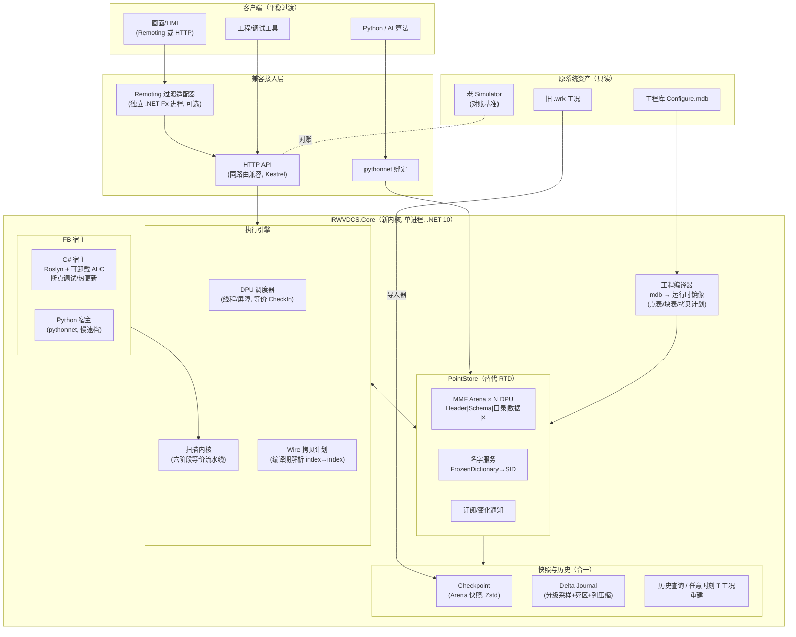

# RWVDCS 深度重构方案 V1（已确认）

> 起草日期：2026-07-05；**确认日期：2026-07-05**
> 输入材料：`调研文档/` 9 篇前期调研、`RWVDCS/docs/` 15 篇内部文档（含 2026 技术决策文档 V1/V2）、对原系统全量源码的四份专项分析报告（见 `分析报告/`）
> 状态：主线方案已获用户确认，进入实施（决策记录见第 10 章）

---

## 1. 结论摘要

**主线方案：基于 .NET 10 LTS 的全栈自研内核重构（继承内部 V2 调研主线并作三处修正），核心思想是"代码与状态彻底分离"。**

| 维度 | 现状 | 重构后 |
| --- | --- | --- |
| 运行时 | .NET Framework 4.7.2（EOL 路线） | .NET 10 LTS（本机已装 SDK 10.0.109） |
| RTD 内存 | `byte[]` + `GCHandle.Pinned` + **伪造 CLR 对象头**（崩溃根因） | `MemoryMappedFile` 连续内存 + `Span<T>` 安全访问，**无任何 CLR 内部 hack** |
| 变量寻址 | SID/FSID + 32 位绝对指针别名 | 保留 SID/FSID 编码语义，全部改为 **index + offset**（无指针） |
| FB 状态 | 状态即对象字段，代码与状态耦合在 RTD 伪对象里 | 状态全部在连续内存 Arena，FB 代码是**无状态内核**，经生成的视图访问 |
| 快照 | 全内存 blob dump + `GC.Collect()`，大工况秒级且有崩溃风险 | Arena 直接落盘（memcpy 级），百 MB 级 < 200ms，加 Zstd 压缩 |
| C# 热更新 | 无（仅离线编译 DLL 到 Plug 目录） | Roslyn 内存编译 + 可卸载 `AssemblyLoadContext`，**改码即时生效**，VS/Rider 可断点调试 |
| 历史站 | Access mdb，写服务未接线（实际无历史站） | 内嵌分级采样 + 死区压缩 + 分块列式存储；**工况=历史时间轴上的命名点**；可选 IoTDB 镜像 |
| Python | 无 | pythonnet 绑定核心 API + Python FB 宿主（分级） |
| 外围（工程库/HTTP API） | Access mdb + NHibernate；两套 HTTP API | 平稳过渡：直接读 mdb，HTTP API 同路由兼容；Remoting 由过渡适配器承接 |

**与内部调研结论的关系**：采纳 V2 文档的主线（.NET 全栈 + MMF 连续内存 + Roslyn/ALC 热更新 + 工况-历史合一），**修正三点**：
1. 历史库从"IoTDB 必选主线"调整为"**内嵌自研时序存储为主，IoTDB 为可选镜像**"——理由见 §6.3；
2. 外围迁移（PG/EF Core/Avalonia/open62541 等）**全部推迟**，本期只做"平稳过渡"所需的最小兼容层——对应用户原则 3"先替代现有功能"；
3. 不引入 Go/NATS/Dragonfly 等多进程基础设施——原系统的多进程通信（Remoting）本质是单机内通信，新内核单进程即可覆盖，降低部署复杂度。

**明确不选**：4diac FORTE / OpenPLC / Beremiz（违反 C# 热更新约束，FB 资产迁移成本过高）、Rust/Go 重写（团队栈不匹配、违反约束 1）、libmdbx/FastDB 做热路径（调研已证明每周期序列化开销不可接受，仅可作冷路径）。

---

## 2. 现状关键认知（重构的事实基础）

四份专项分析报告的核心结论（细节见 `分析报告/01~04`）：

### 2.1 必须根治的问题

| # | 问题 | 证据位置 |
| --- | --- | --- |
| P1 | **TypeManage 伪造 CLR 对象**：在 `byte[]` 里手写 syncblk/TypeHandle/引用指针链（`WiseNew`），读 `MethodTable`/`FieldHandle` 内部偏移算布局——AccessViolation/EEE 崩溃根因，且被 32 位地址假设锁死在 x86 | `RTD/TypeManage.cs` |
| P2 | **指针别名连线**：`ConnectPointToPin` 把 Point 的绝对 IntPtr 写进 Pin 字段，内存整理（GarbageCollection 搬移页面）后靠事件清缓存来防悬空指针，脆弱 | `RTD/PointManage.cs:2950` |
| P3 | **快照性能与安全**：Save 时全量拷贝到临时 `byte[]`（内存峰值翻倍）+ 结尾 `GC.Collect()` STW；Load 后靠 `WiseNew(writeDefaults:false)` 修复对象头 | `RTD/MemoryManage.cs:540`, `PointManage.cs:2518` |
| P4 | **无热更新**：改 FB 代码需离线编译 DLL → 重启加载；无运行中调试 | `FunctionBuilder.cs`（仅离线） |
| P5 | **历史站名存实亡**：`Hist` 写入服务完整但未被任何调用方接线；Remoting 历史查询接口全部空实现 | `History/Hist.cs`、`RemotingObj.cs` |
| P6 | 大量确证 bug：`SetWriteReadAbility` 未写回、`Collation` 等待条件反了、`ConnectPointToPin` links 键错误、`Link`/`PointManageItem` 用 `GetHashCode` 判等 | 分析报告 04 §10 |
| P7 | 执行顺序无拓扑排序，依赖 DB 读取插入顺序；`Function.Implement`/`Command.Execute` 吞异常 | 分析报告 03 |

### 2.2 必须保留的资产与语义

| 资产 | 说明 | 重构策略 |
| --- | --- | --- |
| **106 个 RW 功能块**（`FC_X.cs` 管脚声明 + `FC_X_RUN.cs` 算法）| 双文件 partial 模式，Run 体是纯算法 | Run 体**近乎原样迁移**（生成的视图 API 保持旧语法可用） |
| **LA/LD/LP/LP32 点类型语义**（品质/强制/报警/量程副作用） | HMI、画面、报警全依赖这套语义 | 新类型字段级复刻（清理布局，语义不变） |
| **SID/FSID 寻址**（`FSID = SID<<32 \| offset`） | 全部客户端 API 依赖 | 编码格式原样保留 |
| **Command 六阶段流水线语义**（Wire IN → Pin 同步 → Run → Pin 回写 → Wire OUT → IOMAP 兜底回盖） | 决定输出结果的时序语义 | 语义等价重实现（编译为拷贝计划） |
| **按 DB 插入顺序执行**（无拓扑排序） | 反馈回路的收敛结果依赖执行顺序 | **对齐期严格保序**，后期可选拓扑模式 |
| **多 DPU CheckIn 屏障**、IOMAP 安全点/占用守卫、强制语义 | 已根治过并发崩溃的成熟语义 | 等价重实现 |
| **工程库 mdb 全套表结构**（`Prj_*`/`Cld_*`/`Cfg_VarSystem`/`Meta_*`/`Micro_*`） | 组态工具链的契约 | 直接读取，不改表 |
| **嵌入式 HTTP API 路由**（`/api/point/GetPointValues`、`SetVariables` 等 20 条） | 现有画面/工具已在用 | 同路由同 JSON 兼容实现 |
| .wrk/.prj 双文件概念（运行值与拓扑分离） | 使用习惯 | 新格式保留概念，提供旧 .wrk 导入器 |

---

## 3. 用户五原则 → 设计决策映射

| # | 原则 | 设计决策 |
| --- | --- | --- |
| 1 | 可 Python 可 C#；**保留 C# FB 在线调试/热加载/热更新** | 核心内核用 C#（唯一能同时满足热更新+调试+现有资产的选择）；对外提供 pythonnet 绑定 + Python FB 宿主；FB 热更新用 Roslyn + collectible ALC，因状态在 Arena 外部，**换代码不丢状态** |
| 2 | 核心用成熟组件（OpenCV 式）；上层无 unsafe 指针；用 index，点名 map 成 index | 热路径唯一可行的"成熟组件"是 **OS 级 mmap**（MemoryMappedFile 是 BCL 对它的封装）——调研已证明任何嵌入式 DB 做热路径都慢 2~3 个数量级；压缩用 Zstd/LZ4（工业级 C 库）；可选历史镜像用 IoTDB（Apache 顶级项目）。上层代码 100% safe：`Span<T>`/`MemoryMarshal`/`ref struct`，唯一的 `AcquirePointer` 封装在一个 &lt;100 行的审计类里。点名 → SID(int) 用 `FrozenDictionary` 一次解析，运行期全 index |
| 3 | 先替代现有功能，再谈扩展 | 里程碑以"**对比验证驱动**"组织：每阶段交付物都要过与老系统的输出对账；外围（PG 迁移、新 HMI、OPC UA 重写）全部推迟 |
| 4 | 数十万~百万对象的高效快照存/读 | 状态全部在连续 Arena ⇒ 快照 = 顺序落盘，**无逐对象序列化**。100MB Arena：save ≈ memcpy(25ms) + 异步 Zstd 落盘；load ≈ 读盘 + memcpy。比老系统快 1~2 个数量级，且无 GC.Collect |
| 5 | 时序压缩存储做历史站（变化才存/存储周期/死区）；最好兼容工况与快照实时保存 | **工况-历史合一**：Checkpoint（周期性 Arena 全量快照）+ Delta Journal（分级采样、死区过滤、列式压缩）双层。任意时刻 T 的工况 = 最近 Checkpoint + 重放 Journal 到 T。Journal 本身就是历史站存储，支持按点查询历史曲线 |

---

## 4. 总体架构

### 4.1 分层图



### 4.2 核心机制一：PointStore（连续内存 Arena）

**替代对象**：`MemoryManage` + `PointManage` + `TypeManage` 三件套。

- **每个 DPU 一个 Arena**（对应老系统"每 DPU 一个 Slave RTD"），基于 `MemoryMappedFile`（持久化模式下文件即工况）；另有一个小的全局 Arena 承接跨 DPU 租用点（对应 Master RTD）。
- **布局自主可控**：所有点类型/FB 块类型在新代码中定义为 `Pack=1` 的 blittable 结构体（bool 一律改 byte + bool 属性包装），布局即结构体布局，schema 表由启动时一次反射（或 Source Generator）产出——**彻底告别读 MethodTable/FieldHandle**。
- **寻址**：`SID` = 目录索引（int），记录 `(段, 偏移, 长度, 类型ID, 名字ID)`；`FSID = SID<<32 | 字段偏移` 编码原样保留。点名→SID 在加载期一次性解析进 `FrozenDictionary`，运行期热路径零字符串。
- **访问**：`MemoryMarshal.AsRef<T>(span.Slice(...))` 拿到 `ref T`，单值写用 `Volatile.Write`。对外（HTTP/Python）只暴露 index/FSID + 类型化读写 API。
- **连线别名**：老系统"Pin 与 Point 共享内存"的语义，编译期解析为**槽位合一**（Pin 的存储槽直接指向 Point 槽位的 index 记录），运行期无指针、无拷贝；跨 DPU 连线编译为屏障处的拷贝计划。
- **并发模型**：单写者（DPU 线程）+ 多读者（API/采样器），外部写统一走 IOMAP 队列在周期安全点排空（保留老系统已验证的模式），读侧接受与老系统相同的撕裂语义（单字段 ≤8B 原子）。

### 4.3 核心机制二：FB 代码与状态分离 + 热更新

**目标：`FC_PID_RUN.cs` 的 Run 体几乎不用改就能迁过来。**

```csharp
// 旧（字段即状态）：
public partial class PID : Function {
    [PinType(PinTypes.Input)]  public LA E = new LA(...);
    [PinType(PinTypes.Output)] public LA OUT = new LA(...);
    [PinType(PinTypes.Internal)] public float prevE;
    protected override void Run(ICommand cmd) { OUT[0] = ...; prevE = e; }
}

// 新（声明不变 → 生成器产出布局 + 视图；Run 体语法兼容）：
[FunctionBlock("PID")]
public partial class PID : FbKernel {
    [Pin(PinKind.Input)]  public LA E;        // 声明仅用于生成 schema
    [Pin(PinKind.Output)] public LA OUT;
    [Pin(PinKind.Internal)] public float prevE;
    protected override void Run(in FbContext ctx) {
        // E / OUT / prevE 由生成器重定向为 Arena 上的 ref 访问
        // 运算符重载、.Quality、[0] 索引器语义与旧 LA/LD 完全一致
    }
}
```

- **Source Generator** 从管脚声明生成：该 FB 的状态布局（schema）、Arena 访问器（`ref` 属性）、管脚同步/初值代码。FB 实例在 Arena 中只是**一段字节**；托管世界只有无状态的 kernel 单例。
- **热更新链路**：改代码 → Roslyn 内存编译（带 Portable PDB）→ 新 collectible ALC 加载 → 在周期边界把该 FB 类型的 kernel 委托表切到新实现 → 旧 ALC 卸载。**状态在 Arena，天然保留**；schema 变化（加/删管脚）走显式迁移（按字段名对拷）。
- **调试**：编译产物带 PDB，VS/Rider Attach 即可断点——这就是原来选 C# 的理由，完整保留。
- **Python FB 宿主**：pythonnet 进程内承载，限制在慢速档（秒级 tier），通过同一 FbContext 视图访问 Arena；用于 AI/优化类算法块，不进 50~300ms 硬扫描回路。

### 4.4 核心机制三：执行引擎（语义等价，实现更快）

- DPU = 专用线程 + 周期节拍 + 全 DPU CheckIn 屏障（对齐老系统）。
- **六阶段流水线保留语义**，但实现从"反射缓存的委托逐 Pin 同步"改为**编译期产出的拷贝计划**（`(srcSlot, srcOff, dstSlot, dstOff, len, negate)` 数组的紧密循环），消除运行期反射与装箱。
- 执行顺序：严格按工程编译器产出的顺序表（= 老系统 DB 插入顺序），保证对账可比。
- 异常策略：FB 异常不再静默吞掉——记录到诊断环形缓冲 + 计数器，可配置 fail-fast（对齐期默认与老系统一致继续跑，但有账可查）。

### 4.5 核心机制四：快照 / 工况 / 历史合一

```
Live Arena（每 DPU）
   │  ① Checkpoint：周期性(默认5min)+手动，Arena→staging(双缓冲 memcpy)→Zstd→.ckpt 文件
   │  ② Delta Journal：每周期末采样器按策略表抽点
   │        tier1(每周期/100ms) tier2(1s) tier3(10s+死区%) → 列式块(时间戳delta+值Zstd) 追加 .jrnl
   ▼
时间轴存储（目录即数据库，无服务依赖）
   snapshots/dpu1/20260705-213000.ckpt
   journal/dpu1/tier1/000042.col ...
   workconditions.json  ← 命名工况 = {tag → timestamp}
   │
   ├─ 历史曲线查询：按 (点, 时间范围) 解码列块 → 序列
   ├─ 任意时刻 T 工况：T 之前最近 .ckpt + 重放 journal 到 T → 写回 Arena → 周期边界 swap
   └─ 导出独立工况文件 / 导入旧 .wrk（经转换器）
```

- **策略表**（点模式 glob → tier/死区/保留期）存在工程侧配置，可热下发——对应用户"可配置变化才储存及存储周期、死区压缩"。
- **性能预算**（10 万点，Arena ≈ 10~30MB/DPU）：Checkpoint save P99 < 100ms（不停周期，双缓冲）；命名工况加载 < 200ms；百万点全局工况 < 1s。
- **可选 IoTDB 镜像模块**：同一采样流异步批量写外部 IoTDB，用于跨机集中历史与 Grafana 等生态——默认关闭，不构成部署依赖。

### 4.6 兼容与迁移工具

| 工具 | 说明 |
| --- | --- |
| **工程编译器** | `System.Data.OleDb`(ACE) 直读 Configure.mdb 的 `Prj_*`/`Cld_*`/`Cfg_VarSystem`/`Meta_*` → 产出运行时镜像（点目录、块实例表、执行顺序表、拷贝计划）；附带缓存（mdb 未变则秒开） |
| **旧工况导入器** | 独立 x86 .NET Framework 4.7.2 小程序，只读引用老 DLL 加载 .wrk → 枚举全部点/块字段 → 导出 `名字→值` 中间格式 → 新系统按名导入（不逆向伪对象二进制格式，稳妥） |
| **ParityRunner（对账台）** | 同一工程分别驱动老 Simulator（Remoting `IConsole.SingleStepDCS` + HTTP 批量读）与新内核，锁步 N 周期，逐点对账（默认 bit-exact，可配 epsilon），输出差异报告；支持注入相同的写值/强制序列 |
| **FB 黄金测试** | 对 106 个块逐块生成输入向量（从老系统采集），断言新旧输出逐周期一致；作为回归套件常驻 CI |
| **Remoting 过渡适配器**（按需） | 若现场有必须保留的 Remoting 客户端（画面等）：一个 .NET Fx 4.7.2 进程实现 `ICommunication`/`IConsole`/`IEdit`，转发到新内核 HTTP/gRPC。新客户端一律走 HTTP |

---

## 5. 技术选型 BoM

| 组件 | 选型 | 角色与理由 |
| --- | --- | --- |
| 运行时 | **.NET 10 LTS**（本机 SDK 10.0.109 已装） | LTS 到 2028+；DATAS GC 默认开启；FrozenDictionary/更快的 Span 原语 |
| 连续内存 | `MemoryMappedFile` + `Span<byte>` + `MemoryMarshal`（BCL） | OS mmap 的官方封装 = "成熟底层组件"；native heap 不被 GC 扫描 |
| 压缩 | ZstdSharp（纯托管）起步，必要时切 zstd 原生绑定；LZ4 用 K4os | 工业标准压缩；纯托管版免原生部署问题 |
| FB 编译 | Microsoft.CodeAnalysis.CSharp（Roslyn 4.x） | 内存编译 + Portable PDB |
| FB 热载 | `AssemblyLoadContext`（collectible，BCL） | 可卸载；PoC-1 验证 1 万次重载无泄漏 |
| 布局/访问器生成 | C# Source Generator（编译期）+ 启动期反射校验 | schema 即代码，出错在编译期暴露 |
| 名字服务 | `FrozenDictionary<string,int>` | 点名→index 一次解析 |
| HTTP | ASP.NET Core minimal API（Kestrel 内嵌） | 兼容老嵌入式 API 路由；替代 HttpListener |
| Python | pythonnet 3.x（本机 Python 3.11） | 进程内互调；后续可加 gRPC 子进程档 |
| 工程库读取 | System.Data.OleDb + ACE 驱动（读 mdb） | 平稳过渡不改表；提供 mdb→SQLite 一次性导出工具备用 |
| 历史镜像（可选） | Apache IoTDB 1.3+ 客户端模块 | 树形 schema 契合 DPU.point/fb；默认不启用 |
| 测试/基准 | xUnit + BenchmarkDotNet + ParityRunner | 性能基线纳入 CI |
| 序列化（API 层） | System.Text.Json source-gen | 零反射；核心数据面**不需要**对象序列化 |

**刻意不引入**：NATS/Dragonfly/KeyDB（单进程内核无此需求）、EF Core/PostgreSQL（外围推迟）、Avalonia/React HMI（外围推迟）、open62541（OPC UA 网关沿用现状，后续再换）。

---

## 6. 关键决策论证（对调研文档的取舍）

### 6.1 为什么不是开源 PLC/DCS runtime（V1 文档方案 D）
4diac FORTE / OpenPLC / Beremiz 均无法承载"C# FB 在线调试热更新"这一硬约束；106 个 RW 块 + LA/LD 品质/强制语义需在 IEC 61499/61131 模型里全部重写并双向映射 SID/FSID；OpenPLC v3 已 EOL。**收益（标准化）远小于代价（资产重写 + 约束违背）**。IEC 模型对齐保留为长期演进方向（新内核的"块-管脚-连线"模型有意保持与 61499 概念可映射）。

### 6.2 为什么不是 libmdbx/FastDB/LMDB 做实时库
内部调研（第三方库替代方案篇）已给出量化结论：25 万 FB 每周期经嵌入式 KV 的序列化/反序列化路径需 ~875–1625ms，超周期预算一个数量级。嵌入式 KV 的正确位置是**冷路径**（元数据目录/崩溃恢复），本方案用"MMF 持久化 + Checkpoint 文件"覆盖了该需求，无需再引入一个存储引擎。

### 6.3 为什么历史站"内嵌为主，IoTDB 可选"（对 V2 的修正）
- 原系统历史站实际**未接线**（Hist 服务无调用方），"替代现有功能"并不要求一个服务器级 TSDB；
- 部署形态：仿真/培训站多为单机 Windows，强依赖一个 JVM 服务（IoTDB）显著增加交付与运维复杂度，违背"先平稳替代"；
- 用户明确要求"历史功能兼容工况和快照的实时保存"——Checkpoint+Journal 本来就是工况机制的一部分，让它同时充当历史存储是**最小机制集**；死区/分级/保留期都在采样器一层实现，与存储介质无关；
- 留出 IoTDB 镜像接口：当需要跨机集中历史、Grafana 生态、超长保留期时打开即可，采样流一份两用。

### 6.4 为什么整体仍是"自研内核"而非"成熟 runtime + 封装"
用户原则 2 希望核心像 OpenCV 一样引用成熟项目。逐层检视：**扫描执行内核**这一层在开源世界里与约束兼容的成熟项目不存在（见 6.1）；真正"成熟组件化"的是它下面的层——mmap（OS）、Zstd/LZ4、Roslyn、ALC、IoTDB——本方案全部采用现成组件，自研部分收敛为：Arena 布局管理（~2K 行）、拷贝计划编译器（~2K 行）、扫描调度（~1K 行）、采样/Journal（~3K 行）——都是纯 safe C#，可测试、可替换。

### 6.5 布局兼容策略（新旧二进制不兼容，按名对齐）
老 .wrk 的字节布局包含伪对象头且受 CLR 版本影响，**不做二进制兼容**；一切新旧数据交换走"名字→值"中间层（导入器/对账台）。这规避了最大的隐性风险（复刻 CLR 内部布局），代价是导入旧工况需转换一步（工具自动化）。

---

## 7. 性能目标（对账时持续测量）

| 指标 | 现状（4.7.2, 实测/文档值） | 目标 |
| --- | --- | --- |
| SetVariables 10K 批量 P99 | ~80ms | **< 10ms** |
| 单点写（热路径） | ~3ms（含锁竞争） | < 0.1ms |
| 扫描周期抖动 P99（50 DPU 规模） | 5–20ms | < 5ms |
| 工况保存（10 万点级） | 秒级 + GC.Collect STW | **< 200ms 且不停周期** |
| 工况加载 | 秒级 | < 500ms |
| 常驻内存（10 万点） | ~1.3–2GB（含碎片） | 明显下降（Arena 紧凑 + 无重复镜像） |
| FB 热更新（500 行块） | 不支持 | 改码到生效 < 2s |
| 历史写入 | 无 | ≥ 20 万值/秒（单机采样→Journal） |

PoC 门槛（M0 必须过，否则调整方案）：
1. ALC 万次重载无泄漏；2. MMF Span 单点写 P99 < 0.5µs、10K 批量 < 1ms；3. 50ms 周期 × 24h GC 抖动 P99 < 5ms（DATAS+SustainedLowLatency）；4. Roslyn 单块编译 P99 < 800ms（缓存 MetadataReference）。

### 7.1 M0 PoC 实测（2026-07-05，开发机，Release，百万点 LA）

| 项 | 中位数 | 结论 |
| --- | --- | --- |
| Arena `WriteField<float>` ×100 万 | 2.5ms（≈2.5ns/点） | 门槛 2 通过（超出目标 2 个数量级） |
| Arena `ReadField<float>` ×100 万 | 2.4ms | 同上 |
| Arena `GetRef<LA>().Value` ×100 万（含报警副作用） | 10.1ms | 对照裸数组同语义 6.3ms，MMF+越界检查开销 ≈1.6×，可接受 |
| 快照保存（100 万点，56.3MB 镜像整片落盘） | 46ms | 目标"10 万点 < 200ms"在 10 倍规模下仍余量巨大 |
| 快照就地恢复（运行中切工况路径） | 6.1ms | — |
| 快照冷启动 `LoadFrom`（含重建百万名字表） | 224ms | 目标 < 500ms 通过 |
| 老式逐点序列化对照（BinaryWriter/Reader 循环） | 存 79ms / 读 74ms | 新方案存快 1.7×、就地读快 12×；且老系统实际还有 BinaryFormatter 辅助对象与 GC.Collect 负担 |
| Roslyn 编译：冷 / 热 | 2.72s / **4.0ms** | 冷编译仅进程首次（可启动预热）；热编译 4ms ⇒ 门槛 4 通过，"改码到生效"链路 ≈5ms |
| ALC 装载新代 + 原子切换 | 0.5ms | — |
| ALC 泄漏：300 代热更换代 + 卸载采样 | 0 存活 | 门槛 1 的单测版通过（万次浸泡跑与 24h GC 抖动归入 M2 门禁） |

> 实现要点：整个新代码库仅 `RWVDCS.LowLevel/MappedMemory.cs` 一处 `unsafe`（AcquirePointer 封装），上层全部 `Span`/index 寻址；FB 内核源码编译时强制 `allowUnsafe:false`。

---

## 8. 里程碑（对比验证驱动）

| 阶段 | 内容 | 出口判据（可演示） |
| --- | --- | --- |
| **M0 基建+PoC**（~2 周） | 仓库/CI/基准框架；四项 PoC；ParityRunner 骨架（能控老系统单步+批量读） | PoC 报告全绿；对账台能采老系统数据 |
| **M1 PointStore+工程编译器**（~4 周） | Arena/schema/名字服务/订阅；mdb 直读编译出点表与块表 | 真实工程 mdb 加载，点目录与老系统逐名一致 |
| **M2 内核+C# 宿主最小闭环**（~6 周） | 扫描流水线、拷贝计划、C# FB 宿主（先静态编译）；迁移 ~20 个高频块 | 单 DPU 测试工程与老系统锁步对账 1 万周期 0 差异 |
| **M3 全量块+多 DPU 对齐**（~6 周） | 106 块全迁（生成器辅助）；多 DPU 屏障/跨 DPU 连线/IOMAP/强制/订阅通知 | 真实项目全量对账 0 差异（含写值/强制注入场景）；性能基准达标 |
| **M4 快照/工况/历史**（~4 周） | Checkpoint+Journal+策略表+任意 T 重建；旧 .wrk 导入器；HTTP API 兼容层全量 | 工况存/读/按 T 加载演示；历史曲线查询；老画面经 HTTP 正常读写 |
| **M5 热更新+Python+收尾**（~4 周） | Roslyn 热更新链路+调试体验；pythonnet 绑定+Python FB 宿主（慢速档）；文档/部署 | 现场式演示：运行中改 PID 代码即时生效且状态保留；Python 写一个算法块跑通 |
| （后续独立立项） | Remoting 适配器（视现场客户端盘点）、IoTDB 镜像、OPC UA 重写、工程库迁 SQLite/PG、可视化调试 UI | — |

> 里程碑按"1 名主力 + AI 协作"的节奏估算，实际可并行压缩；每个里程碑的对账结果都会保留成回归基线。

---

## 9. 风险登记

| 风险 | 等级 | 缓解 |
| --- | --- | --- |
| 浮点结果与老系统不 bit-exact（JIT/融合乘加差异） | 中 | 对齐期锁 `float` 运算次序与老代码一致；对账支持 epsilon 分级；差异逐块归因 |
| 执行顺序还原不完全（老系统顺序来自 DB 读取细节） | 高 | 工程编译器复刻 `InitFCByDatabase` 遍历逻辑；对账台首查执行序 |
| 宏块（114 个未编译）与 HOLLYSYS 缺失块 | 中 | 对齐期以"当前 csproj 实际编译的 106 块"为准；宏块按需求单独立项 |
| ACE 驱动缺失导致 mdb 读不了 | 低 | 检测+提示安装 ACE 运行库；备用 mdb→SQLite 导出工具（x86 老环境跑） |
| ALC 长会话泄漏 | 中 | PoC-1 验证；编辑会话 ALC 计数告警；生产模式禁用编译模块 |
| GC 抖动不达标 | 低 | 关键路径零分配（Span/池化）+ MMF 在 native heap；兜底预案：扫描线程隔离进程 |
| 老 Remoting 客户端不可弃用 | 中 | 现场客户端盘点（决策点 Q4）；适配器进程方案已备 |
| 单人/小团队周期风险 | 中 | 里程碑粒度小、每步有可回归的对账基线；生成器让 106 块迁移大部分机械化 |

---

## 10. 决策记录（2026-07-05 用户已确认）

| # | 决策 | 结论 |
| --- | --- | --- |
| Q1 | 主线：.NET 10 全栈自研内核 + MMF Arena + 代码/状态分离 + Roslyn/ALC 热更新 | **已确认采纳** |
| Q2 | 历史站：内嵌 Checkpoint+Journal 为主、IoTDB 作可选镜像 | **已确认采纳** |
| Q3 | 工程库：本期直读 Configure.mdb 不迁移 | 已确认（随 Q1 主线） |
| Q4 | Remoting 老客户端 | **通讯要高效**——新主通道用高效协议（HTTP/gRPC）；其他 Remoting 客户端同步更改接入新通道；**测试期可单独写一个简单适配器过渡**（不做长期维护承诺） |
| Q5 | 对账精度：目标 bit-exact，允许阶段性 epsilon | 已确认（随 Q1 主线） |
| Q6 | 新代码位置：`D:\项目\睿渥\RWVDCS重构\src`，解决方案名 `RWVDCS.Next` | 已确认 |
| Q7 | 宏块/HOLLYSYS 块 | **本期只迁当前实际编译的 106 个 RW 块**；114 个宏块后续单独立项 |

---

## 附：新代码仓库结构（拟）

```
RWVDCS重构/
├─ 调研文档/                  # 已有
├─ 分析报告/                  # 已有（原系统四份专项分析）
├─ RWVDCS重构方案-V1.md       # 本文档
└─ src/
   ├─ RWVDCS.Next.sln
   ├─ Core/
   │  ├─ PointStore/          # Arena/schema/名字服务/订阅
   │  ├─ Engine/              # DPU 调度/扫描流水线/拷贝计划
   │  ├─ Fb/                  # FbKernel 基类/上下文/LA-LD-LP 新类型
   │  ├─ Fb.Generators/       # Source Generator（schema/视图/同步）
   │  ├─ Hosting.CSharp/      # Roslyn 编译 + ALC 热更新
   │  ├─ Hosting.Python/      # pythonnet 宿主（M5）
   │  ├─ History/             # Checkpoint/Journal/策略/查询/T 重建
   │  └─ Compiler/            # mdb 工程编译器
   ├─ Blocks.RW/              # 迁移的 106 个功能块
   ├─ Api.Http/               # 兼容 HTTP API（Kestrel）
   ├─ Bindings.Python/        # pythonnet 对外绑定
   ├─ Tools/
   │  ├─ ParityRunner/        # 对账台（含 .NET Fx 子工具控老系统）
   │  ├─ WrkImporter/         # 旧 .wrk 导入器（x86 .NET Fx）
   │  └─ MdbExporter/         # mdb→SQLite 备用导出
   └─ Tests/
      ├─ UnitTests/
      ├─ GoldenTests/         # 106 块黄金向量
      └─ Benchmarks/          # BenchmarkDotNet
```
