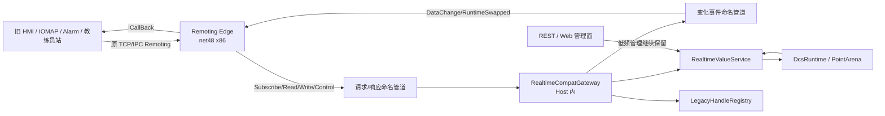
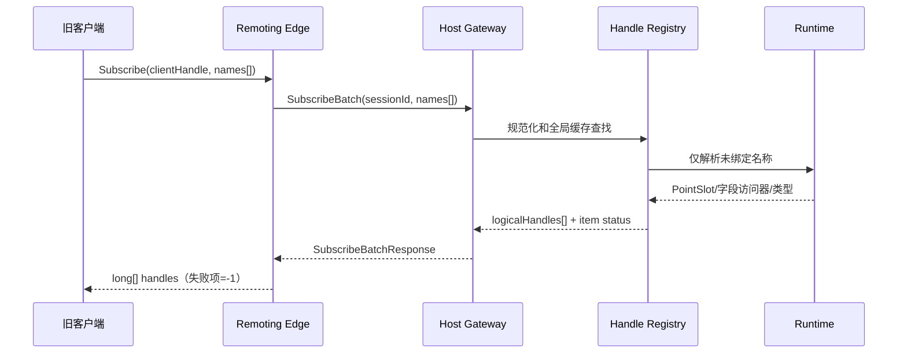
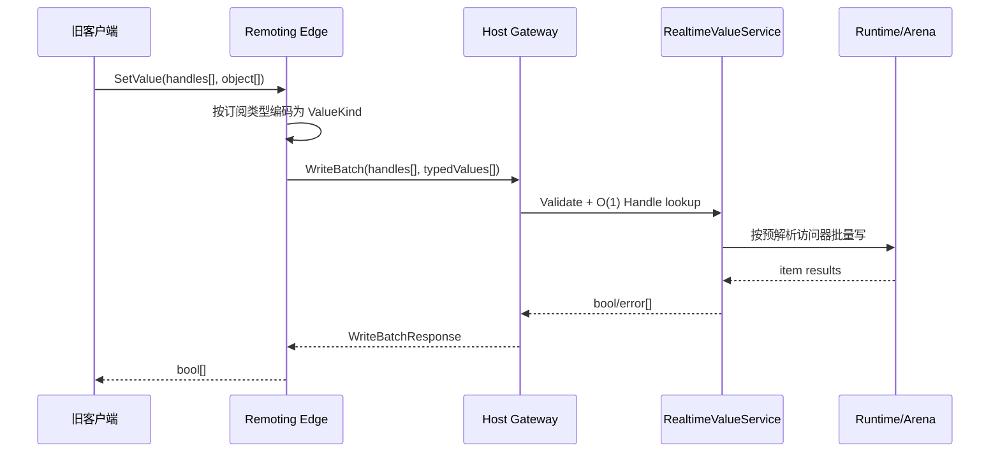
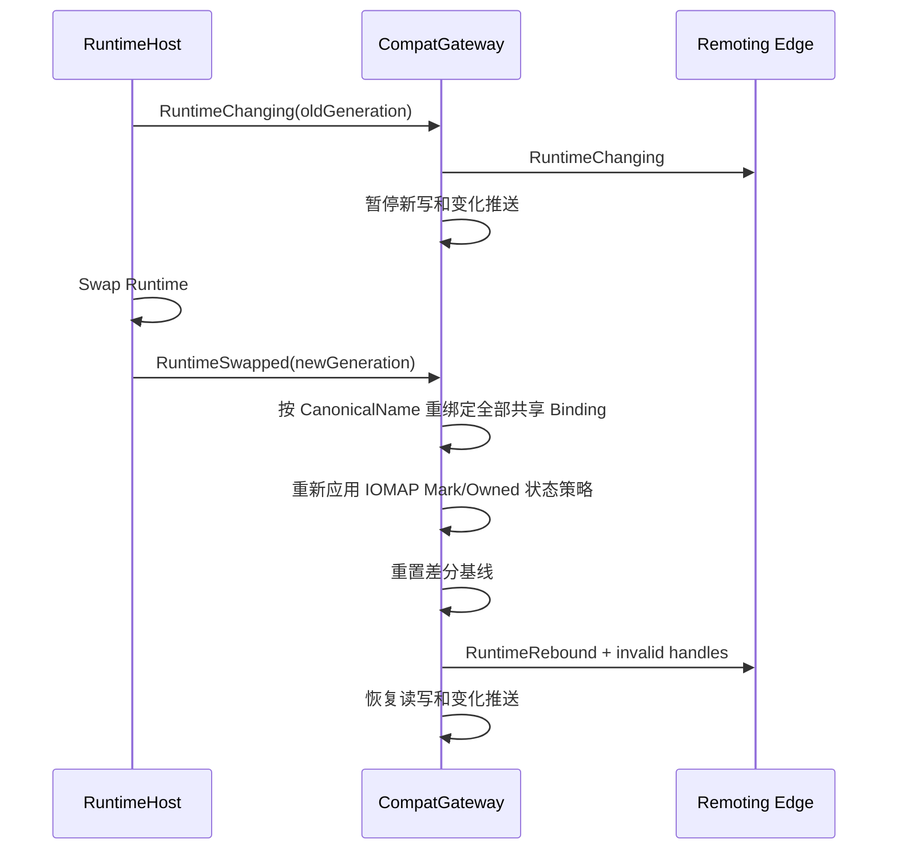

# RWVDCS Remoting 兼容高性能通讯最终实施方案

> 文档状态：最终实施方案（待评审后执行）  
> 编制日期：2026-07-28  
> 适用代码库：`D:\项目\睿渥\RWVDCS重构`  
> 本期范围：旧 Remoting 客户端的订阅、批量读写、变化通知及兼容会话  
> 核心原则：保留旧客户端二进制兼容，移除 Remoting 适配器与新 Host 之间的 HTTP/JSON 高频中转

---

## 1. 执行摘要

### 1.1 最终结论

当前新 Host 以 `.NET 10` 运行，旧客户端依赖 `.NET Framework Remoting`、`PS.Comm.dll` 和原有 `Communication` URI。由于 .NET 10 不提供原生 .NET Remoting 运行时，若要求旧客户端完全不改，就不能把 Remoting Server 直接并入当前 Host，也不能直接删除所有 `.NET Framework` 兼容进程。

最终采用以下双阶段方案：

1. **兼容阶段**：保留一个极薄的 `net48 x86 Remoting Edge`，仅承担旧 Remoting 协议、会话和旧回调；删除 Edge 到 Host 之间的 REST/JSON 高频路径，改用“Host 稳定逻辑句柄 + 本机双工命名管道 + 固定二进制协议 + Host 主动增量推送”。
2. **退役阶段**：逐步把可修改客户端切换到新的兼容客户端 SDK，直接连接 Host 的现代协议；所有旧客户端迁移完成后，删除 Remoting Edge。

兼容阶段的目标调用链：

```text
旧客户端
  → 原 TCP/IPC Remoting
  → Remoting Edge（net48 x86）
  → 本机二进制命名管道
  → RealtimeCompatGateway（Host 内）
  → 已解析访问器
  → DcsRuntime / PointArena
```

### 1.2 明确不采用的方案

本方案明确不采用：

- 在 `.NET 10` Host 内直接调用 `System.Runtime.Remoting`；
- 为保留 Remoting 而把新 Host 降级为 `net48 x86`；
- 在同一进程内混合托管 CLR4 与 CoreCLR；
- 假定第三方“Remoting”库与原 .NET Remoting wire format 兼容；
- 让 x86 Edge 直接写入 Host Arena 共享内存；
- 在新内部 IPC 中继续使用 BinaryFormatter、任意 `object` 类型图或 CLR 类型名反序列化；
- 把当前 REST 轮询作为长期实时订阅机制。

### 1.3 预期收益

实施完成后，高频路径将消除：

- 第二层 HTTP 请求处理；
- JSON 请求/响应序列化；
- `object → string → JSON → string → typed value` 往返转换；
- 每次读写时的点名重新解析；
- 适配器周期性 `/values/read` 轮询；
- 大量匿名对象、字符串、`JsonDocument`、字典和临时数组分配；
- 因 HTTP 同步等待造成的线程占用和超时放大。

保留下来的额外成本主要是一次本机命名管道批量调用，性能模型接近原系统“订阅时解析一次、后续按 FSID/Handle 直接读写”。

---

## 2. 背景与现状

### 2.1 原版关键路径

原版订阅入口：

```csharp
public long[] Subscribe(string[] dpunames, string[] names, string[] members, bool Unknow)
```

位置：`D:\项目\睿渥\RWVDCS\DCS\Dcs.cs:3068`

原版批量写入口：

```csharp
public bool[] SetVariables(string ClientInfo, long[] FSIDs, object[] Values)
```

位置：`D:\项目\睿渥\RWVDCS\DCS\Dcs.cs:3299`

原版性能特征：

- Remoting 反序列化后直接进入 Simulator 进程内 DCS；
- 订阅成功后使用 FSID，不需要每次重新解析名称；
- 批量写使用 FSID 路由缓存和按目标 RTD 分桶；
- Master/Slave 存在批量更新路径；
- 不经过 HTTP 和 JSON；
- 实时数据更新和订阅变化通知在同一运行时内部完成。

### 2.2 当前重构版关键路径

当前适配器订阅入口：

```csharp
public long[] Subscribe(int clientHandle, string[] names)
```

位置：`src/Compat/RWVDCS.RemotingAdapter/Subscriptions.cs:128`

当前适配器写入入口：

```csharp
public bool[] Write(int clientHandle, long[] handles, object[] values, string userInfo)
```

位置：`src/Compat/RWVDCS.RemotingAdapter/Subscriptions.cs:328`

当前完整链路：

```text
旧客户端
  → Remoting/BinaryFormatter
  → RemotingAdapter
  → 适配器 Handle 查找名称
  → object 转文本
  → System.Text.Json 序列化
  → HTTP POST
  → Kestrel API
  → JSON 反序列化
  → 按名称解析 PointSlot/块字段
  → 文本重新解析为实际值类型
  → 写入 PointArena/块字段
  → JSON 响应
  → HTTP 返回
  → JSON 解析
  → Remoting 序列化返回客户端
```

### 2.3 已确认的主要性能损耗

#### 2.3.1 订阅阶段

首次订阅未缓存名称时，适配器调用：

```text
POST /api/values/describe
```

对应位置：

- `Subscriptions.cs:170`
- `ApiServer.cs:647`

Host 需要逐项执行 `DescribeMember`，构造 JSON 描述，再返回适配器。IOMAP 点还可能触发独立的标记请求。

#### 2.3.2 写入阶段

当前适配器在每次批量写时：

1. 使用适配器内部 Handle 查出名称；
2. 把 `object` 转换成文本；
3. 构造匿名 JSON item；
4. 同步发送 HTTP；
5. Host 再按名称解析访问对象；
6. Host 再把文本转换为 `float/bool/ushort/uint/...`；
7. 逐项返回布尔结果。

关键位置：

- `Subscriptions.cs:348`：`RestBridge.ToWireText`
- `Subscriptions.cs:357`：`POST values/write`
- `RestBridge.cs:92`：JSON 序列化
- `RestBridge.cs:96`：响应读取为字符串
- `ApiServer.cs:615`：`/values/write`
- `ApiServer.cs:625`：逐项 `TryWriteMember`
- `ApiServer.cs:1310`：名称和文本值重新解析

#### 2.3.3 变化通知阶段

当前适配器不是由 Host 主动推送实时变化，而是：

1. 每隔 `_pollMs` 唤醒；
2. 对所有活动会话计算订阅并集；
3. 调用 `/values/read`；
4. 解析 JSON；
5. 在适配器做差分；
6. 再通过 Remoting 回调旧客户端。

关键位置：

- `Subscriptions.cs:438`：轮询循环
- `Subscriptions.cs:450`：`Thread.Sleep(_pollMs)`
- `Subscriptions.cs:379`：`POST values/read`
- `Subscriptions.cs:524`：`InformDataChange`

此路径会持续产生 HTTP、JSON、字典、数组和装箱开销。

---

## 3. 技术约束与决策边界

### 3.1 运行时约束

当前项目边界：

| 组件 | 目标框架/位数 | 作用 |
|---|---|---|
| `RWVDCS.Host` | `net10.0-windows x64` | 新内核运行宿主 |
| `RWVDCS.Api` | `net10.0` | Kestrel REST/Web 服务 |
| `RWVDCS.Runtime` | `net10.0` | DCS Runtime、Arena、调度 |
| `RWVDCS.RemotingAdapter` | `net48 x86` | 旧 Remoting 二进制兼容 |
| `PS.Comm.dll` | 旧 .NET Framework、Requires32Bit | 旧客户端契约 |

适配器项目明确依赖：

- `System.Runtime.Remoting`
- `PS.Comm.dll`
- `PlatformTarget=x86`

.NET Remoting 基础设施不属于 .NET 10，因此旧客户端不改的情况下，必须保留一个 .NET Framework 兼容边界。

### 3.2 业务兼容约束

兼容阶段必须保持：

- 原 `PS.Comm.Interfaces.ICommunication` 方法签名；
- 原 `IConsole`、必要的 `IEdit` 方法签名；
- 原 `ICallBack` 回调形状；
- URI 仍为 `Communication`；
- 原 TCP/IPC Remoting 连接方式；
- `ClientHandle` 会话语义；
- `long Handle/FSID` 订阅后读写语义；
- 返回数组与输入位置一一对应；
- LA/LD/LP/LP32 装箱类型；
- `.value`/`.buffer`、DPU 前缀、点名包含 `$`/`.` 等兼容规则；
- IOMAP Ownership 与回盖值语义；
- 回调模式和 `GetChangedData` 轮询模式。

### 3.3 安全约束

旧 Remoting 使用 BinaryFormatter，并启用了 `TypeFilterLevel.Full`。该能力只允许作为受控兼容入口：

- 不能暴露到互联网；
- 不能允许不可信客户端访问；
- 必须使用 Windows 防火墙白名单；
- 必须限制调用数组、字符串和消息大小；
- Edge 以低权限服务账号运行；
- Edge 与 Host 的内部通道只能在本机开放；
- 新 IPC 禁止使用 BinaryFormatter 或任意类型反序列化。

---

## 4. 建设目标与非目标

### 4.1 建设目标

1. 保证旧客户端零改动接入。
2. 把实时高频链路中的 REST/JSON 完全移除。
3. 名称只在订阅或 Runtime 换代时解析，正常读写按 Host 句柄执行。
4. 单个批量请求只发生一次 Edge→Host IPC 往返。
5. Host 主动产生订阅增量，删除适配器 REST 轮询。
6. 保持 IOMAP、装箱类型、错误位置和旧回调语义。
7. 支持工程加载、在线下装、工况加载后的自动重绑定。
8. 支持 Edge/Host 任一侧重启后的可靠重连和重新订阅。
9. 建立可量化的性能、稳定性和兼容性验收基线。
10. 为最终移除 Remoting 保留清晰迁移路径。

### 4.2 非目标

本期不要求：

- 在 .NET 10 中重新实现完整的 .NET Remoting wire protocol；
- 把全部低频管理 API 都迁出 REST；
- 让 Edge 直接操作 Runtime 内存；
- 一次性改造所有旧客户端；
- 改变 DCS 扫描、功能块执行或 Arena 核心布局；
- 用共享内存替代所有 IPC；
- 长期保留 Remoting 作为新系统主协议。

---

## 5. 最终目标架构

### 5.1 逻辑架构



### 5.2 组件职责

#### Remoting Edge

只负责：

- 注册原 TCP/IPC Remoting Channel；
- 引用 `PS.Comm.dll`；
- 实现旧接口；
- 管理旧 `ClientHandle` 与回调代理；
- 将旧方法参数转换为内部固定协议；
- 把 Host 返回的类型化值装箱为旧客户端期望类型；
- 接收 Host 变化事件并执行 `ICallBack`；
- 实现断线重连和会话重放。

不再负责：

- 按名称读取 Host；
- JSON 序列化；
- HTTP 高频请求；
- 定时 REST 轮询；
- Runtime 点名解析；
- 维护真实 PointSlot/字段绑定。

#### RealtimeCompatGateway

运行在 `RWVDCS.Host` 进程内，负责：

- 命名管道监听；
- 固定二进制协议解析；
- 请求鉴权、大小限制和版本协商；
- 会话、订阅和 Host Handle 管理；
- 调用统一的 `RealtimeValueService`；
- Runtime 换代重绑定；
- 变化事件分发；
- 指标、故障和协议日志。

#### RealtimeValueService

作为 Host 内唯一实时值访问服务，供以下入口共同调用：

- 新 IPC Gateway；
- 现有 REST 批量读写 API；
- 后续现代客户端协议；
- 测试和基准工具。

该服务统一处理：

- 名称规范化；
- 点/点字段/块字段解析；
- 类型转换；
- IOMAP Ownership；
- 批量读写；
- Runtime generation；
- 错误码和兼容结果。

#### LegacyHandleRegistry

由 Host 持有，维护旧兼容逻辑句柄与当前 Runtime 访问器之间的映射，并在 Runtime 换代时重新绑定。

---

## 6. Host 逻辑句柄设计

### 6.1 设计原则

1. 旧客户端看到的 `long Handle` 在会话有效期内保持稳定。
2. Handle 不直接等同于 Arena SID、内存地址或 `PointSlotRef` 内部值。
3. Host 使用 Handle O(1) 查找预解析访问器。
4. Runtime 换代后，按原名称更新 Handle 后面的访问器，不修改旧客户端 Handle。
5. Handle 失效时明确返回失败，不能写入错误对象。

### 6.2 建议数据模型

```text
LegacyHandleEntry
  LogicalHandle       long
  CanonicalName       string
  OriginalName        string
  RuntimeGeneration   ulong
  TargetKind          PointBuffer | PointField | BlockField
  ValueKind           Boolean | UInt16 | UInt32 | Int32 | Int64 | Single | Double | String
  Writable            bool
  Found               bool
  IomapOwned           bool
  Accessor             预解析访问器
  LastBindError        错误码/诊断信息
```

### 6.3 Handle 分配

建议由 Host 统一分配 64 位单调逻辑 Handle：

```text
0                保留为无效/未初始化
-1               保留为订阅失败的外部兼容返回值
1..long.MaxValue Host 逻辑 Handle
```

不建议在 Handle 内硬编码 DPU/SID，因为在线下装后 DPU 顺序和 SID 可能变化。

### 6.4 去重与作用域

Host 内可维护两层结构：

```text
全局名称绑定缓存：CanonicalName → SharedBinding
会话订阅表：SessionId → LogicalHandle 集合和顺序
```

相同名称可共享实际访问器和差分读取，但每个会话保留自己的：

- 订阅顺序；
- 回调开关；
- 暂停状态；
- 最近已发送值；
- `GetChangedData` 游标；
- 慢客户端待发送合并队列。

---

## 7. 预解析访问器设计

### 7.1 Point buffer 快路径

订阅时将名称解析为：

```text
PointSlotRef + PointKind
```

后续直接读写：

| PointKind | 旧客户端装箱类型 | 二进制负载 |
|---|---|---|
| LA | `Single` | IEEE 754 4 字节 |
| LD | `Boolean` | 1 字节 |
| LP | `UInt16` | 2 字节 |
| LP32 | `UInt32` | 4 字节 |

### 7.2 Point 子字段

对以下字段在订阅时解析出固定字段种类或偏移：

- `buffer/value`
- `quality`
- `isforced`
- `forcevalue`
- `istrace`
- `maxvalue`
- `minvalue`

后续禁止每次调用 `PointFieldAccess.ReadAll()` 再按字符串查找。

### 7.3 块管脚和块字段

订阅时解析：

```text
BlockCommand + FieldMetadata + 编译后的 getter/setter
```

实施要求：

- `FieldInfo` 只能用于初次绑定；
- 热路径使用缓存委托；
- LA/LD/LP/LP32 包装类型保持 `.Value` 语义；
- 字段不可写时在订阅描述中标记；
- Runtime 换代后重新创建委托。

### 7.4 名称规范化

统一名称规范化服务必须覆盖：

- `[DPU$]NAME[.member]`；
- 点名自身包含 `$` 和 `.`；
- 整名命中优先；
- DPU 前缀仅在真实匹配 DPU 时生效；
- 最后一个 `.` 才作为成员拆分候选；
- `.value` 与 `.buffer` 等价；
- `IOMapDirection2_` 只按严格前缀处理；
- 大小写不敏感语义；
- 旧客户端名称原样保留用于重绑定和诊断。

REST 与 IPC 不得分别维护两套名称规则。

---

## 8. 内部 IPC 协议

### 8.1 传输选择

本机 Edge→Host 使用 Windows 双工命名管道：

- 请求管道：`RWVDCS.Realtime.Request.v1`
- 事件管道：`RWVDCS.Realtime.Events.v1`

名称应允许通过配置覆盖，并包含实例标识，避免同机多实例冲突：

```text
RWVDCS.{InstanceId}.Realtime.Request.v1
RWVDCS.{InstanceId}.Realtime.Events.v1
```

选择命名管道的原因：

- .NET Framework 4.8 与 .NET 10 均原生支持；
- 本机内核传输，无 HTTP 路由与 JSON；
- 支持双工和异步 I/O；
- 可应用 Windows Pipe ACL；
- 不额外开放 TCP 端口；
- 部署和诊断复杂度低于共享内存协议。

### 8.2 帧格式

建议采用固定小端帧：

| 字段 | 类型 | 说明 |
|---|---:|---|
| Magic | `uint32` | 固定协议标识 |
| MajorVersion | `uint16` | 主版本，不兼容变化递增 |
| MinorVersion | `uint16` | 向后兼容扩展版本 |
| Operation | `uint16` | 操作码 |
| Flags | `uint16` | 压缩、响应、事件、错误等标志 |
| RequestId | `uint64` | 请求/响应关联 |
| SessionId | `int32` | 内部会话 |
| RuntimeGeneration | `uint64` | 当前 Runtime 代次 |
| PayloadLength | `int32` | 负载长度 |
| HeaderChecksum | `uint32` | 可选，防头部损坏 |

必须在分配 Payload 缓冲前校验：

- Magic；
- 协议版本；
- Operation；
- PayloadLength 下限和上限；
- Session 是否存在；
- 数组元素数量上限；
- 字符串 UTF-8 字节数上限。

### 8.3 值编码

值使用显式 `ValueKind`，禁止发送 CLR 类型名：

| ValueKind | 编码 |
|---|---|
| Null | 无负载 |
| Boolean | 1 字节 0/1 |
| Byte | 1 字节 |
| UInt16 | 2 字节小端 |
| UInt32 | 4 字节小端 |
| Int32 | 4 字节小端 |
| Int64 | 8 字节小端 |
| Single | 4 字节原始 IEEE 754 |
| Double | 8 字节原始 IEEE 754 |
| String | 长度 + UTF-8 |

规则：

- `NaN`、正负无穷和负零保留原始位；
- 不使用区域性格式；
- 数值不先转字符串；
- 非法类型逐项返回类型错误，不影响批次其他位置；
- String 设置单值最大长度。

### 8.4 操作码

首期必须实现：

| 操作 | 方向 | 说明 |
|---|---|---|
| Hello | Edge→Host | 版本、实例、进程、能力协商 |
| HelloAck | Host→Edge | 协议版本、Host generation、能力 |
| Attach | Edge→Host | 创建内部会话 |
| Detach | Edge→Host | 删除内部会话 |
| Renew | Edge→Host | 会话探活 |
| SubscribeBatch | Edge→Host | 批量订阅名称 |
| UnsubscribeBatch | Edge→Host | 批量退订 Handle |
| UnsubscribeAll | Edge→Host | 清空会话订阅 |
| ReadBatch | Edge→Host | 按 Handle 批量读取 |
| ReadAll | Edge→Host | 按会话订阅顺序读取 |
| WriteBatch | Edge→Host | 按 Handle 批量写入 |
| PollChanged | Edge→Host | `GetChangedData` 模式取增量 |
| SetDataInformType | Edge→Host | 开关主动变化通知 |
| PauseSession | Edge→Host | 暂停/恢复会话通知 |
| DataChanged | Host→Edge | 主动变化事件 |
| RuntimeChanging | Host→Edge | Runtime 即将换代 |
| RuntimeRebound | Host→Edge | 句柄重新绑定完成 |
| SubscriptionInvalidated | Host→Edge | 部分订阅失效 |
| Heartbeat | 双向 | 通道健康检查 |
| Error | 双向 | 协议级错误 |

### 8.5 错误模型

协议错误使用固定错误码，错误消息只用于诊断：

```text
Ok
InvalidRequest
UnsupportedVersion
MessageTooLarge
SessionNotFound
InvalidHandle
NotFound
NotWritable
TypeMismatch
ConversionFailed
RuntimeUnavailable
RuntimeChanging
RuntimeGenerationMismatch
Timeout
Busy
InternalError
```

批量结果必须按输入顺序返回：

```text
ItemResult
  Success
  ErrorCode
  OptionalDiagnostic
```

对旧 `bool[]` API，Edge 仅映射 `Success`；详细错误写入受采样限制的诊断日志。

---

## 9. 订阅流程

### 9.1 正常订阅



### 9.2 性能要求

- 同批名称去重后再解析；
- 已绑定名称不再访问反射或完整点表；
- 一批只发生一次 IPC 请求/响应；
- 不再调用 `/values/describe`；
- 不再为每个 item 构造匿名 JSON 对象；
- 会话订阅顺序必须与输入顺序一致；
- 重复订阅不重复加入会话顺序，但返回同一逻辑 Handle；
- 无效名称返回 `-1`，不能影响有效项。

### 9.3 IOMAP 订阅

对严格以 `IOMapDirection2_` 开头的点：

1. 保留原始名称；
2. 生成剥前缀后的 canonical name；
3. 绑定实际 PointSlot；
4. 在 Host Runtime 内调用 IOMAP Mark；
5. Handle 记录 `IomapOwned=true`；
6. Runtime 换代时重新 Mark；
7. 不再发送额外 `/values/iomap/mark` HTTP 请求。

---

## 10. 批量写流程

### 10.1 正常写入



### 10.2 写入规则

1. `count = Min(handles.Length, values.Length)` 的旧语义需经契约测试确认并固定。
2. 返回数组长度必须与旧公开接口约定一致。
3. null、无效 Handle、不可写目标、类型转换失败只影响当前位置。
4. Point buffer 走直接类型化写入。
5. Point 子字段走固定字段访问器。
6. Block 字段走缓存 setter。
7. 不得在热路径执行点名解析。
8. 不得把数值转换为文本。
9. 不得逐点执行 IPC。
10. 必须保留 `ClientInfo/UserInfo`。

### 10.3 批量执行优化

Host 可按访问目标分组：

```text
Point buffer fast path
Point field path
Block field path
IOMAP owned path
```

若基准证明有收益，再进一步按 DPU/Arena 分桶；首期应优先保证兼容正确性和一次 IPC 批量处理，避免过早复制原 RTD 的复杂路由模型。

### 10.4 IOMAP 写语义

满足任一条件时按 IOMAP 写处理：

- Handle 在订阅时被标记 `IomapOwned`；
- `ClientInfo` 严格匹配 `IOMAP_` 前缀。

写入成功时必须：

1. 写 Point buffer；
2. Mark Ownership；
3. 更新 OwnedValue；
4. 保证周期末回盖逻辑继续生效。

不能只 Mark 不保存 OwnedValue。

---

## 11. 批量读取与变化通知

### 11.1 主动变化推送

Host 对所有需要主动通知的会话构造订阅并集，对每个共享绑定只读取一次。建议在以下两个模式中通过基准选择：

- 扫描周期结束后触发；
- 独立 50～200ms 定时扫描。

兼容初期可保持当前默认 200ms 可感知节奏，但扫描位置改到 Host 内部，后续按客户端需要缩短。

### 11.2 差分规则

- `Single/Double` 按原始位比较，正确区分负零并稳定处理 NaN；
- 整数和布尔按值比较；
- 字符串使用序号或内容比较；
- 首次订阅是否立即通知必须与旧系统行为对账；
- Runtime 换代后重置比较基线；
- 无变化时不发送 DataChanged 负载。

### 11.3 会话投递

每个会话维护：

```text
LastSent              主动回调基线
LastPolled            GetChangedData 基线
PendingLatest         慢客户端期间每个 Handle 的最新值
CallbackInFlight      当前回调状态
Sequence              事件序号
```

慢客户端策略：

- 每个会话只有一个在途回调；
- 回调忙时把同一 Handle 合并为最新值；
- 使用有界集合，不能无限增长；
- 不得在回调尚未成功投递时永久丢弃最新值；
- 某一客户端失败不影响其他客户端；
- 连续失败达到阈值后 Detach，并记录原因。

### 11.4 GetChangedData

`GetChangedData` 不再触发一次 Host 全量读取。Host 已维护变化序列，调用时只读取该会话尚未消费的增量或最新合并值。

必须与主动回调保持独立游标，避免一种消费模式影响另一种模式。

---

## 12. Runtime 换代与在线下装

### 12.1 Generation 模型

Host 启动时生成非零 `RuntimeGeneration`，以下操作成功切换 Runtime 后递增：

- 工程装载；
- 在线下装 commit；
- 工况加载导致 Runtime 替换；
- 其他重建 Runtime 的操作。

### 12.2 重绑定流程



### 12.3 换代期间请求策略

建议：

- 新 Subscribe：返回 `RuntimeChanging`，Edge 短暂重试；
- Read：可返回 `RuntimeChanging`，不读取旧 Runtime；
- Write：禁止写旧 Runtime，返回 `RuntimeChanging`；
- 管理命令：按原有 RuntimeHost 串行化规则执行；
- Edge 重试必须有上限和指数退避；
- 不能无限阻塞 Remoting 调用。

### 12.4 失效处理

重绑定结果：

- 同名同类型：继续有效；
- 同名兼容类型：按明确转换规则决定，默认保守失败；
- 同名不同目标种类：失效；
- 名称删除：失效；
- 不可写变为可写/可写变不可写：更新元数据并按新状态执行；
- IOMAP 点不存在：清除该 Binding 的可写能力并上报。

---

## 13. 连接、重连与故障隔离

### 13.1 启动顺序

推荐启动顺序：

1. 启动 Host；
2. Host 创建命名管道；
3. 启动 Remoting Edge；
4. Edge 完成 Hello/版本协商；
5. Edge 注册 Remoting TCP/IPC Channel；
6. 允许旧客户端接入。

若因部署原因 Edge 先启动：

- Remoting Channel 可先监听；
- Attach/业务请求明确返回服务未就绪；
- 后台按退避策略连接 Host；
- 不进行无限同步等待。

### 13.2 Host 断线

Edge 检测到 Host 通道断开后：

- 标记所有内部会话为待恢复；
- 停止向旧客户端发送伪造变化；
- 新读写快速失败，不等待 60 秒 HTTP 超时；
- 后台重连；
- 重连成功后重新 Attach；
- 按原顺序批量重放订阅名称；
- 建立旧 Handle 到新 Host Handle 的内部映射；
- 重置回调基线；
- 恢复服务。

旧客户端外部 Handle 是否跨 Host 重启保持不变，由 Edge 保持外部 Handle 并映射到新 Host Handle，避免要求旧客户端主动重新订阅。

### 13.3 Edge 断线

Host 通过管道断开和租约超时释放：

- 内部会话；
- 会话订阅；
- 待发送事件；
- 差分基线。

共享 Binding 可设置短期缓存，避免 Edge 快速重启时重新反射解析全部名称。

### 13.4 超时建议

按操作分类配置，而不是统一 60 秒：

| 操作 | 建议策略 |
|---|---|
| Subscribe/Read/Write | 本机短超时，失败快速返回 |
| Attach/Renew | 短超时，可重试 |
| Runtime 重绑定 | 独立较长超时，不占用普通请求管道 |
| 下装/工况/装载 | 继续使用管理面长操作机制 |
| Callback | 每客户端独立超时和失败计数 |

具体数值在性能和现场网络基线后固化。

---

## 14. 并发模型

### 14.1 Host Gateway

- 管道读写使用异步 I/O；
- 每条连接只负责帧接收和发送，不执行长时间业务；
- 请求解码后进入有界执行队列；
- Read/Write 使用不可变 Handle 快照；
- Runtime 换代使用 generation 和读写门控；
- 不在全局锁中执行回调、管道写或反射；
- 会话表、Binding 表和 Runtime 访问器生命周期分离。

### 14.2 Edge

- Remoting 同步方法可同步等待对应 IPC 请求，但必须有短超时；
- 单个慢客户端不能占满全部线程；
- 回调事件与请求响应使用独立管道；
- 日志不得在全局会话锁内同步写控制台；
- 订阅集合变更使用细粒度锁或不可变快照；
- 断线重放在单独后台状态机执行。

### 14.3 背压

必须设置：

- 最大在途请求数；
- 单消息最大 Payload；
- 单批最大点数；
- 单会话最大订阅数；
- 事件队列最大项数/字节数；
- 单客户端最大回调并发数为 1；
- 超限时明确返回 `Busy/MessageTooLarge`，不能继续分配内存。

---

## 15. 安全方案

### 15.1 Remoting 外部入口

- TCP Remoting 仅绑定明确网卡或通过防火墙限制来源；
- IPC Remoting 仅用于本机旧客户端；
- 禁止端口直接暴露互联网；
- 部署在受控 VLAN；
- 对 Attach、Subscribe、Write 的数组长度设限；
- 对字符串长度和日志内容设限；
- Edge 使用独立低权限 Windows 服务账号；
- 记录连接来源、会话、写入数量和拒绝原因；
- 制定 Remoting 退役时间表。

### 15.2 内部命名管道

- Pipe ACL 只允许 Host 服务账号、Edge 服务账号和必要管理员；
- 拒绝 Everyone/Anonymous；
- Hello 中校验 InstanceId、协议版本和随机启动标识；
- 可选使用部署时生成的本机共享密钥进行挑战应答；
- 严格校验所有长度和操作码；
- 禁止任意类型反序列化；
- 诊断错误不得返回内部路径、堆栈和敏感信息给旧客户端。

### 15.3 审计

写入审计至少包含：

```text
time
edge instance
client handle
user info
source endpoint
batch count
success/fail count
sample handles/names（限量）
runtime generation
duration
error code
```

高频成功日志应聚合，避免逐点写日志导致新的性能问题。

---

## 16. 项目与代码组织建议

### 16.1 新增项目

建议新增一个双目标或共享协议项目，避免 Host 与 Edge 复制协议常量：

```text
src/Compat/RWVDCS.CompatProtocol/
  RWVDCS.CompatProtocol.csproj
  ProtocolConstants.cs
  FrameHeader.cs
  OperationCode.cs
  ErrorCode.cs
  ValueKind.cs
  BinaryFrameReader.cs
  BinaryFrameWriter.cs
  Limits.cs
```

目标框架建议选择双方均可引用的安全最小交集，例如 `netstandard2.0`；协议项目不得引用 Runtime、ASP.NET Core、Remoting 或 `PS.Comm.dll`。

### 16.2 Host 侧新增目录

```text
src/Api/RWVDCS.Api/Compat/
  RealtimeCompatGateway.cs
  CompatPipeServer.cs
  CompatSessionManager.cs
  LegacyHandleRegistry.cs
  SubscriptionBinding.cs
  ChangeScanner.cs
  RuntimeRebinder.cs
  CompatMetrics.cs

src/Runtime/RWVDCS.Runtime/Realtime/
  IRealtimeValueService.cs
  RealtimeValueService.cs
  ValueAccessor.cs
  PointBufferAccessor.cs
  PointFieldAccessor.cs
  BlockFieldAccessor.cs
  RealtimeValueResult.cs
```

最终目录可根据现有分层调整，但必须保持：

- 协议层不依赖 Runtime；
- Edge 不依赖 Runtime；
- REST 与 IPC 共用内部值服务；
- Remoting 类型不进入 net10 核心项目。

### 16.3 Edge 侧重构

```text
src/Compat/RWVDCS.RemotingAdapter/
  RemotingBridge.cs             保留旧接口映射
  CompatPipeClient.cs           新增请求客户端
  CompatEventClient.cs          新增事件客户端
  EdgeSessionManager.cs         外部/内部会话映射
  EdgeSubscriptionMap.cs        外部 Handle/Host Handle 映射
  EdgeReconnectStateMachine.cs  重连和订阅重放
  RestBridge.cs                 仅保留低频管理或过渡回退
  Subscriptions.cs              分阶段缩减并最终移除 REST 热路径
```

### 16.4 现有 REST 的处理

以下 REST 可暂时保留：

- 工程装载；
- 下装 prepare/commit；
- 工况保存/加载；
- 元数据分页；
- 历史查询；
- 运行控制；
- 日志和管理台。

以下高频 REST 在 IPC 稳定后不再供 Edge 使用：

- `/values/describe`
- `/values/read`
- `/values/write`
- `/values/iomap/mark`

接口可继续供工具或调试使用，但必须通过统一 `RealtimeValueService`，避免语义分叉。

---

## 17. 分阶段实施计划

### 阶段 P0：基线与契约冻结

#### 工作项

1. 建立原版和当前适配器版性能基准。
2. 采集真实客户端的调用形态和批量大小分布。
3. 冻结 Subscribe/Read/Write/Callback/IOMAP 兼容语义。
4. 为旧版和重构版建立相同输入的对账工具。
5. 记录 Runtime 装载/下装时现有 Handle 行为。

#### 交付物

- 性能基线报告；
- 接口兼容矩阵；
- 真实点名样本集；
- IOMAP 专项样本；
- 回调行为说明；
- 初始 SLO。

#### 退出条件

- 能把总耗时拆分到 Remoting、Edge、HTTP、JSON、Host 解析和实际写入；
- 有可重复的 1/100/1,000/10,000 点基准；
- 关键兼容行为有自动化断言。

### 阶段 P1：统一 RealtimeValueService

#### 工作项

1. 从 `ApiServer` 提取名称解析和批量读写服务。
2. 建立预解析 Accessor 抽象。
3. 保证现有 REST 改为调用统一服务。
4. 覆盖 Point buffer、Point field、Block field。
5. 统一 IOMAP 处理。

#### 交付物

- `RealtimeValueService`；
- Accessor 单元测试；
- REST 行为回归测试；
- 名称规范化测试。

#### 退出条件

- 现有 API 行为不回退；
- 名称解析规则只有一套；
- 已绑定 Accessor 可在不再次传名称的情况下读写。

### 阶段 P2：协议与 Host 命名管道

#### 工作项

1. 新建共享协议项目。
2. 实现帧解析、限长、错误码和版本协商。
3. 实现 Host Pipe Server。
4. 实现 Attach/Detach/Renew。
5. 实现 SubscribeBatch/ReadBatch/WriteBatch。
6. 建立协议 fuzz/非法输入测试。

#### 交付物

- `RWVDCS.CompatProtocol`；
- Host Gateway；
- 命令行协议测试客户端；
- IPC 基准报告。

#### 退出条件

- 单批请求只进行一次 IPC；
- Write 热路径无 JSON、无文本数值转换、无点名解析；
- 非法帧不能导致 Host 崩溃或大内存分配；
- Host 重启后 Pipe 可重新监听。

### 阶段 P3：Edge 接入 Pipe，REST 双轨验证

#### 工作项

1. Edge 新增 Pipe Client。
2. Remoting Subscribe/Read/Write 映射到新协议。
3. 保留 `--transport rest|pipe` 配置。
4. 增加 shadow/对账模式：同一输入比较 REST 与 Pipe 结果，但只执行一个写入源。
5. 增加故障注入和重连测试。

#### 交付物

- Pipe 版 Edge；
- 双轨配置；
- 对账报告；
- 部署脚本和运维说明。

#### 退出条件

- 订阅和写值兼容测试全部通过；
- Pipe 性能达到阶段 SLO；
- 可通过配置快速回退 REST；
- Edge/Host 任一重启后能恢复会话。

### 阶段 P4：Host 主动变化推送

#### 工作项

1. 实现 ChangeScanner。
2. 实现事件管道。
3. Edge 实现事件接收和旧回调。
4. 实现慢客户端最新值合并。
5. 实现 `GetChangedData` 独立游标。
6. 删除 Edge 对 `/values/read` 的周期性调用。

#### 交付物

- DataChanged 事件链；
- 回调压力测试；
- 慢客户端和断线测试报告；
- 无变化资源占用报告。

#### 退出条件

- Edge 不再定时调用 `/values/read`；
- 无变化时不产生持续 JSON/HTTP 分配；
- 慢客户端不影响其他会话；
- 回调和 PollChanged 结果与旧系统对账通过。

### 阶段 P5：Runtime 换代与生产加固

#### 工作项

1. 接入 `RuntimeSwapped`。
2. 实现 generation 和重绑定。
3. 重新应用 IOMAP 标记。
4. 实现失效订阅通知。
5. 完成限流、指标、ACL、安全审计。
6. 完成 24/72 小时稳定性测试。

#### 交付物

- RuntimeRebinder；
- 下装/工况专项报告；
- 安全配置模板；
- 生产监控面板；
- 回滚手册。

#### 退出条件

- 下装后 Handle 不会写错对象；
- 同名点自动恢复；
- 删除/变更点明确失败；
- IOMAP 回盖正确；
- 稳定性和资源指标达标。

### 阶段 P6：客户端迁移与 Remoting 退役

#### 工作项

1. 提供现代兼容客户端 SDK。
2. 保持上层 Attach/Subscribe/Get/Set/Callback 风格。
3. 逐个迁移内部和现场客户端。
4. 统计 Remoting 活跃客户端。
5. 全部迁移后关闭 Remoting 端口并删除 Edge。

#### 退出条件

- 连续一个发布周期无 Remoting 客户端接入；
- 所有客户端资产有新协议版本；
- 完成现场回退演练；
- 正式删除 `RWVDCS.RemotingAdapter` 部署单元。

---

## 18. 性能测试与验收指标

### 18.1 测试矩阵

批量规模：

```text
1 / 10 / 100 / 1,000 / 10,000 / 50,000
```

数据类型：

```text
LA / LD / LP / LP32 / 混合类型 / Point field / Block field
```

场景：

- 冷订阅；
- 热订阅；
- 重复订阅；
- 单点写；
- 批量写；
- 批量读；
- 无变化回调；
- 1%、10%、100% 变化；
- 1/10/50 个客户端；
- IOMAP 与普通点混合；
- 慢回调；
- Host/Edge 重启；
- Runtime 在线下装；
- 24/72 小时连续运行。

### 18.2 采集指标

每个场景记录：

- 吞吐量；
- P50/P95/P99/Max；
- Edge CPU；
- Host CPU；
- Edge/Host 工作集；
- Gen0/Gen1/Gen2 次数；
- 每次调用分配字节数；
- Pipe 发送/接收字节数；
- 在途请求数；
- Handle 查找耗时；
- Accessor 执行耗时；
- Callback 排队和投递延迟；
- 合并变化数量；
- 丢弃/失败/超时数量；
- Runtime 重绑定耗时。

### 18.3 初始相对 SLO

在 P0 获得旧系统绝对基线前，先采用相对目标：

| 指标 | 目标 |
|---|---|
| 热订阅 P95 | 不超过原版 1.2 倍 |
| 批量写 P95 | 不超过原版 1.3 倍 |
| 批量读 P95 | 不超过原版 1.3 倍 |
| Edge→Host 增量开销 | 不超过总耗时 20% |
| 10,000 点写 IPC 次数 | 1 次请求 + 1 次响应 |
| 写热路径 JSON 调用 | 0 |
| 写热路径按名解析 | 0 |
| 无变化时 REST 轮询 | 0 |
| 单客户端回调并发 | 最大 1 |
| 慢客户端影响其他客户端 | 不允许 |
| Runtime 换代写错目标 | 0 |
| 变化永久丢失 | 0（允许同 Handle 合并为最新值） |

P0 后应补充绝对毫秒和吞吐指标，并以真实最大工程与现场硬件为准。

---

## 19. 兼容性测试清单

### 19.1 输入边界

- `names == null`；
- 空数组；
- `handles == null`；
- `values == null`；
- Handle 和 Value 长度不一致；
- Values 含 null；
- 无效 Handle；
- 超大数组；
- 超长名称；
- 非法 UTF-8/协议帧；
- 重复名称；
- 不同大小写名称。

### 19.2 名称和类型

- `POINT`；
- `POINT.buffer`；
- `POINT.value`；
- `DPU$POINT.member`；
- 点名自身包含 `$`；
- 点名自身包含 `.`；
- 块管脚；
- 块常量；
- 块内部字段；
- LA→Single；
- LD→Boolean；
- LP→UInt16；
- LP32→UInt32；
- Float NaN/Infinity/-0；
- 数值越界；
- 字符串和枚举字段。

### 19.3 会话与变化

- Attach/Detach/Renew；
- 同一客户端重复订阅；
- 多客户端订阅同一点；
- Pause/Resume；
- SetDataInformType；
- 主动 Callback；
- GetChangedData；
- Callback 抛异常；
- Callback 超时；
- Callback 期间继续变化；
- Edge 重启；
- Host 重启；
- Pipe 短断线；
- 请求超时和取消。

### 19.4 IOMAP

- `IOMapDirection2_` 严格前缀；
- 非严格相似名称不能误匹配；
- `IOMAP_` ClientInfo；
- 订阅 Mark；
- 写入 OwnedValue；
- 功能块周期输出后的回盖；
- Runtime 换代后重新 Mark；
- 点删除后的失效处理；
- 普通点不能被误登记为 IOMAP。

### 19.5 Runtime 换代

- 同名同类型；
- 同名类型变化；
- 点删除；
- 点新增后重新订阅；
- DPU 顺序变化；
- SID 变化；
- 工况加载；
- 下装成功；
- 下装回滚；
- 换代期间读写；
- 换代期间客户端断线。

---

## 20. 可观测性

### 20.1 指标

Host 至少输出：

```text
compat_pipe_connections
compat_active_sessions
compat_active_subscriptions
compat_shared_bindings
compat_subscribe_duration
compat_read_duration
compat_write_duration
compat_change_scan_duration
compat_change_items
compat_event_queue_depth
compat_callback_coalesced_items
compat_invalid_handles
compat_protocol_errors
compat_runtime_generation
compat_rebind_duration
compat_rebind_failures
```

Edge 至少输出：

```text
remoting_active_clients
pipe_connected
pipe_reconnect_count
pipe_request_duration
pipe_timeouts
callback_inflight
callback_failures
callback_queue_depth
rest_fallback_count
```

### 20.2 日志

日志分级：

- Info：启动、连接、重连、Runtime 换代、会话数量变化；
- Warning：超时、回调失败、订阅失效、队列接近上限；
- Error：协议错误、重绑定失败、持续断线；
- Debug/Trace：单批请求明细，仅在诊断开关开启时采样。

禁止默认逐点记录成功读写。

### 20.3 健康检查

Host 管理面提供兼容 Gateway 健康信息：

```text
enabled
pipe listening
edge connected
protocol version
runtime generation
active sessions
active subscriptions
last request time
last event time
rebind state
```

---

## 21. 配置建议

Host 配置示例：

```json
{
  "CompatGateway": {
    "Enabled": true,
    "InstanceId": "default",
    "RequestPipeName": "RWVDCS.default.Realtime.Request.v1",
    "EventPipeName": "RWVDCS.default.Realtime.Events.v1",
    "MaxSessions": 128,
    "MaxSubscriptionsPerSession": 200000,
    "MaxBatchItems": 50000,
    "MaxPayloadBytes": 16777216,
    "ChangeScanIntervalMs": 200,
    "RequestQueueCapacity": 1024,
    "EventQueueCapacity": 100000
  }
}
```

Edge 参数示例：

```text
rwvdcs-remoting-adapter.exe
  --port 8002
  --transport pipe
  --instance default
  --request-pipe RWVDCS.default.Realtime.Request.v1
  --event-pipe RWVDCS.default.Realtime.Events.v1
  --request-timeout-ms 3000
  --connect-timeout-ms 5000
```

过渡期可保留：

```text
--transport rest
--api http://localhost:8090
```

但生产 Pipe 模式下，不建议高频请求自动静默回退 REST。自动回退会掩盖 Pipe 故障并造成性能突然退化。更合理的策略是：

- 测试期允许显式 fallback；
- 生产期 Pipe 故障快速失败并报警；
- 运维人员通过配置切换为 REST 应急模式。

---

## 22. 发布、灰度与回滚

### 22.1 发布顺序

1. 先发布包含 Gateway、但默认关闭的 Host；
2. 验证现有 REST 行为未变化；
3. 开启 Gateway，只连接测试 Edge；
4. Edge 使用 Pipe 完成只读和订阅验证；
5. 开启写入 shadow 对账，但避免同一写执行两次；
6. 小范围客户端切 Pipe Edge；
7. 扩大到全部旧客户端；
8. 稳定后关闭 Edge 高频 REST；
9. 最后移除 Edge REST 轮询代码。

### 22.2 双轨规则

双轨期间：

- 订阅和读操作可同时比较结果；
- 写操作不能 REST 和 Pipe 各执行一次；
- 写对账可使用“Pipe 实际写 + REST 只读验证”或离线录制回放；
- 回调只能选择一个权威来源；
- 每个客户端明确记录当前 transport。

### 22.3 回滚

发生严重兼容问题时：

1. 停止新 Edge 接入；
2. 将 Edge transport 显式切回 REST；
3. 保留 Host Gateway 但停止接收业务；
4. 收集协议、Handle、generation 和错误指标；
5. 不回滚 Runtime 核心和工程数据；
6. 修复后重新进行小流量灰度。

回滚不得要求删除用户工程、工况或 Runtime 数据。

---

## 23. 风险与控制措施

| 风险 | 影响 | 控制措施 |
|---|---|---|
| 旧客户端存在未盘点调用模式 | 兼容失败 | P0 采集真实调用；保留 REST 应急模式；方法级统计 |
| Runtime 换代后 Handle 指向旧对象 | 数据写错 | Host 逻辑 Handle + generation + 重绑定门控 |
| 慢回调导致事件堆积 | 内存增长、延迟 | 有界队列、同 Handle 最新值合并、单会话单回调 |
| Pipe 断线导致长时间阻塞 | Remoting 客户端卡死 | 短超时、快速失败、后台重连 |
| 协议解析漏洞 | Host 崩溃或内存耗尽 | 固定协议、限长、ACL、无任意类型反序列化、fuzz 测试 |
| REST 与 IPC 语义分叉 | 行为不一致 | 统一 RealtimeValueService |
| IOMAP 只 Mark 未保存 OwnedValue | 周期后读回错误 | IOMAP 专项契约测试；统一写服务 |
| x86 Edge 内存不足 | Edge 崩溃 | Edge 不保存大值快照；有界集合；共享绑定尽量在 Host |
| 批量消息过大 | LOH/GC 压力 | MaxBatch/MaxPayload；分片；缓冲池 |
| 过早使用共享内存 | ABI 和换代复杂度 | 首期只用命名管道；基准不达标再立项只读 MMF |
| BinaryFormatter 安全风险 | 远程代码执行风险 | 网络隔离、白名单、低权限、尽快迁移客户端 |

---

## 24. 最终验收清单

### 架构

- [ ] 旧客户端仍连接原 `Communication` URI。
- [ ] Host 保持 `net10.0 x64`。
- [ ] Edge 保持 `net48 x86`，但仅承担协议边缘职责。
- [ ] Edge→Host 高频路径不再使用 HTTP/JSON。
- [ ] REST 与 IPC 共用统一实时值服务。

### 订阅

- [ ] 名称只在首次绑定或 Runtime 换代时解析。
- [ ] 热订阅复用共享 Binding。
- [ ] Handle 在会话和 Runtime 换代中保持兼容稳定。
- [ ] 无效项准确返回 `-1`。
- [ ] IOMAP 前缀和 Mark 语义正确。

### 读写

- [ ] 批量请求一次 IPC 完成。
- [ ] 写入不经过字符串转换。
- [ ] 写入不按名称重新解析。
- [ ] LA/LD/LP/LP32 装箱类型正确。
- [ ] Point field/Block field 行为对账通过。
- [ ] IOMAP OwnedValue 回盖正确。

### 变化通知

- [ ] Edge 不再周期性调用 `/values/read`。
- [ ] Host 只扫描订阅并集。
- [ ] 无变化不发送负载。
- [ ] 慢客户端不阻塞其他客户端。
- [ ] 同 Handle 允许合并为最新值，但最新变化不永久丢失。
- [ ] Callback 与 GetChangedData 独立。

### Runtime 换代

- [ ] Runtime generation 正确递增。
- [ ] 换代期间禁止写旧 Runtime。
- [ ] 同名点自动重绑定。
- [ ] 删除/变更点明确失效。
- [ ] IOMAP 状态正确重建。
- [ ] 不存在 Handle 写错目标。

### 性能和稳定性

- [ ] 达到 P0 后确定的 P95/P99 SLO。
- [ ] 10,000 点批量写只发生一次 IPC 请求/响应。
- [ ] 热路径 JSON 调用为零。
- [ ] 24/72 小时稳定性测试通过。
- [ ] Edge 和 Host 重启恢复测试通过。
- [ ] 无界队列、无界 Task 和无界分配检查通过。

### 安全和运维

- [ ] Remoting TCP 配置来源白名单。
- [ ] Pipe ACL 只允许指定账号。
- [ ] 消息、数组和字符串均有限长。
- [ ] 指标、健康检查和审计日志完整。
- [ ] REST 应急回滚流程已演练。
- [ ] Remoting 客户端退役清单和计划已建立。

---

## 25. 长期演进路线

兼容方案不是最终主协议。长期应提供现代客户端 SDK，使业务代码仍可使用熟悉的调用模型：

```text
Attach
Subscribe
Read
Write
DataChanged
```

但底层直接连接 Host，不再经过 .NET Remoting。

建议迁移顺序：

1. 自动化测试和内部工具；
2. 教练员站；
3. PointInfo/调试工具；
4. IOMAP；
5. Alarm；
6. HMI；
7. 外部现场客户端；
8. 关闭 Remoting TCP/IPC；
9. 删除 Edge 部署和 `PS.Comm.dll` 运行依赖。

最终架构应收敛为：

```text
现代客户端 SDK
  → Host 现代协议
  → RealtimeValueService
  → DcsRuntime / PointArena
```

---

## 26. 方案决策记录

| 决策项 | 最终决策 |
|---|---|
| 是否把 Remoting 直接并入 net10 Host | 否，运行时不支持 |
| 是否删除所有兼容进程 | 旧客户端未迁移前否 |
| 是否保留当前 REST 高频中转 | 否 |
| Edge→Host 传输 | 本机双工命名管道 |
| 内部序列化 | 固定二进制协议、显式 ValueKind |
| 热路径寻址 | Host 稳定逻辑 Handle + 预解析 Accessor |
| 变化通知 | Host 订阅并集差分 + 事件管道主动推送 |
| Runtime 换代 | Generation + 按名重绑定 + 写门控 |
| 共享内存 | 首期不采用；仅在基准需要时考虑只读快路径 |
| REST 定位 | 管理面、低频能力和过渡回滚 |
| Remoting 定位 | 有退役期限的旧客户端兼容入口 |
| 最终目标 | 客户端直连 Host，删除 Remoting Edge |

---

## 27. 官方技术依据

- Microsoft：Remoting APIs are obsolete  
  <https://learn.microsoft.com/en-us/dotnet/core/compatibility/core-libraries/5.0/remoting-apis-obsolete>

- Microsoft：.NET Framework technologies unavailable on .NET，明确说明 .NET 6+ 不支持 .NET Remoting，并建议使用 Pipe、MemoryMappedFile 或现代网络协议  
  <https://learn.microsoft.com/en-us/dotnet/core/porting/net-framework-tech-unavailable>

- Microsoft：BinaryFormatter security guide，明确说明 BinaryFormatter 不安全且不能被配置为安全  
  <https://learn.microsoft.com/en-us/dotnet/standard/serialization/binaryformatter-security-guide>

- Microsoft：TcpChannel 仅应处理可信数据  
  <https://learn.microsoft.com/en-us/dotnet/api/system.runtime.remoting.channels.tcp.tcpchannel>

---

## 28. 最终批准建议

建议批准以下实施决策：

> 在旧客户端未完成迁移前，保留 `net48 x86 Remoting Edge` 作为唯一兼容入口；立即停止把 REST/JSON 作为 Remoting 实时数据的长期内部通道。建设 Host 内 `RealtimeValueService`、`LegacyHandleRegistry` 和 `RealtimeCompatGateway`，使用双工命名管道与固定二进制协议完成订阅、批量读写和变化推送。完成客户端迁移后，删除 Remoting Edge。

该方案在以下三方面取得平衡：

1. **兼容性**：旧客户端和 `PS.Comm.dll` 无需立即修改；
2. **性能**：恢复“订阅时解析、运行期按句柄直接读写”的模型；
3. **可演进性**：不污染 .NET 10 核心，不把 Remoting 固化为新系统长期协议。

---

## 29. 实施结果（2026-07-28）

本方案的兼容阶段已在重构仓库落地，未修改原版程序。已完成：

- 新增 `RWVDCS.CompatProtocol` (`netstandard2.0`)，定义 36 字节固定帧头、显式 `ValueKind`、批量边界与请求/事件操作码；
- Host 新增 `RealtimeValueService`，实现稳定逻辑 Handle、名称一次解析、预解析访问器、按句柄批量读写和订阅并集差分；
- Host 新增 `RealtimeCompatGateway`，提供独立请求管道和事件管道，变化数据按“会话 + Handle”合并最新值；
- Edge 的 Subscribe/Read/Write/Poll/Unsubscribe 高频路径已切换为命名管道，默认不再使用 HTTP/JSON 或 REST 轮询；
- Edge 继续对外暴露原 `PS.Comm.dll` Remoting 接口，老 HMI/IOMAP/Alarm 无需修改；
- Runtime 换代时按名重绑定；Host 重启时 Edge 重建会话并按原顺序重放订阅，对老客户端保持 Edge Handle 稳定；
- 事件管道每秒发送轻量心跳，可及时发现空闲断线；慢 Remoting 回调按 Handle 合并最新值，不建立无界队列；
- 保留 `--transport rest` 作为显式应急模式，Pipe 故障不会静默降级。

已完成的验证：

- 兼容协议单元测试：帧往返、装箱类型、浮点位模式、超限批量和非法 Magic；
- 使用真实 MDB（50 DPU / 120,707 点 / 3 块）和 `net48` 老 Remoting 测试客户端完成 Attach、Subscribe、GetValue、SetValue 和 `InformDataChange`；
- 验证 `Boolean`、`Single`、`UInt32` 装箱类型与值一致；
- 同一 MDB 运行时重载后，旧客户端仍收到原 Handle `#1/#2/#3` 的回调；
- Host 完整停止并重启后，Edge 自动恢复 1 个会话和 3 个订阅，旧客户端继续收到原 Handle 的变化回调。

同机开发环境的快速对比基准（真实 MDB、同一 Remoting 测试客户端、同一 Host）：

| 场景 | Pipe | REST 应急模式 | Pipe 耗时降低 |
|---|---:|---:|---:|
| 500 次 × 3 点批量读 | 0.256 ms/批 | 0.509 ms/批 | 49.7% |
| 500 次 × 3 点批量写 | 0.218 ms/批 | 0.484 ms/批 | 55.0% |
| 200 次 × 200 点批量读 | 0.273 ms/批 | 0.810 ms/批 | 66.3% |
| 200 次 × 200 点批量写 | 0.569 ms/批 | 0.781 ms/批 | 27.1% |

该数据用于证明路径优化有效，不代替生产环境的 P95/P99 容量验收。可使用回归客户端的 `--bench N` 参数在目标机器复测。

本期仍保留 Remoting Edge：这是“不修改旧客户端”的必要兼容边界，不是长期主协议。只有当所有旧客户端改为直连 Host 的现代 SDK 后，才可删除 Edge。

---

## 30. 大批量订阅取消故障修正（2026-07-29）

现场曾出现请求管道和事件管道均已连接，但 10,859/23,171 项订阅分别在约 70/67 秒后以“已取消一个任务”失败。该时间不是 `CompatBinary.Build` 或管道写入时间，而是一次请求超时后执行“重连、恢复会话、重试”形成的累计耗时。

根因位于 Host 名称解析的失败回退路径：名称不能按点位解析时，旧实现会遍历全部 DPU 及 Command 查找块成员。批量名称数量为 N、工程命令数量为 M 时，最坏复杂度为 O(N×M)。大量 IOMAP 名称、无效名称或格式不匹配名称会将 Host 处理时间放大至请求超时。

已实施以下修正：

- `RealtimeValueService` 按 Runtime 实例一次性建立 DPU、全局 Command、DPU 内 Command 的大小写不敏感字典索引，点位解析失败后的块成员查询改为 O(1)；
- Runtime Generation 未变化时，已经确认不存在的名称不再重复解析；工程换代后仍会按名重新绑定；
- Host 对大批订阅输出 `read/resolve/encode/total` 分段耗时及 `found` 数量；
- Adapter 对失败请求输出 `lockWait/connect/total`，并将模糊的“已取消一个任务”转换为包含操作名和配置时限的 `TimeoutException`；
- Adapter 不再只依赖 net48 命名管道异步读取的取消令牌；增加同步硬截止时间，到期主动关闭请求管道，确保 `--request-timeout-ms` 不会从 3 秒被放大成数十秒。

新版本验收时应同时观察两端日志：

```text
[Host] [IPC性能] Host Subscribe count=23171, found=..., read=... ms, resolve=... ms, encode=... ms, total=... ms
[适配器] [IPC性能] Send op=SubscribeBatch ... lockWait=... ms connect=... ms write=... ms host+read=... ms total=... ms
[适配器] [IPC性能] Subscribe count=23171 ... encode=... ms send=... ms decode=... ms total=... ms
```

判定规则：

- Host `resolve` 高：名称格式或 Host 索引/绑定路径仍有问题；
- Adapter `lockWait` 高、Host 同期没有慢请求：同一请求管道前方有长调用或重连恢复；
- Adapter `host+read` 高且 Host `total` 高：Host 业务处理慢；
- Adapter `host+read` 高但 Host `total` 低：管道响应写入、进程调度或客户端读取存在阻塞；
- `found=0` 且写值 `errors=0/success=0`：通讯请求成功，但订阅名称未解析出有效 Handle；这不是写值传输错误。

该修正需要 Host 和 Adapter 都重启到新编译版本后才生效。仅替换 Adapter 无法修复 Host 的 O(N×M) 名称解析问题。
