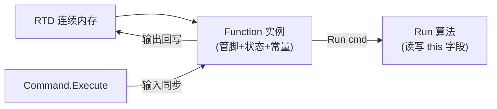
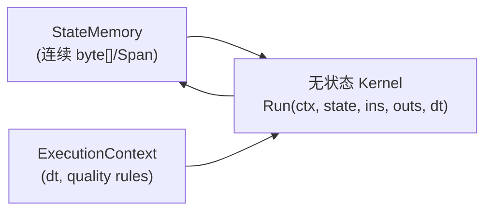

# RWVDCS 功能块库与数据类型技术报告

> 分析范围：`D:\项目\睿渥\RWVDCS`（.NET Framework 4.7.2，只读）
> 统计方法：对 `[FCName` 做 `grep` 计数；对 `FunctionCode.csproj` 核对实际编译项

---

## 1. 功能块数量统计

| 分类 | `[FCName` 出现次数 | 说明 |
|------|-------------------|------|
| **RW 目录** | **106** | `Function\RW\FC_*.cs`（不含 `*_RUN.cs`） |
| **宏块 Macro** | **114** | `Function\Properties\Macro\FC_*.cs` |
| **HOLLYSYS 目录** | **0** | 目录不存在；`ARCHITECTURE.md` 有规划，源码未纳入 |
| **Function 根目录遗留块** | **12** | 如 `FC_ANALOGAlarm.cs`、`Add.cs` 等 |
| **合计（磁盘源码）** | **232** | 全 `Function` 目录 grep 总数 |

**编译现状（重要）**

- `Function\FunctionCode.csproj` 仅包含 **106 个 RW 块**（212 个 `Compile Include`，106 定义 + 106 `*_RUN.cs`）。
- **114 个宏块 + 12 个根目录块均未列入 csproj**，当前 `FunctionCode.dll` 实际只编译 RW 块。
- csproj 第 308 行仅有空文件夹引用 `<Folder Include="Macro\" />`，宏块源码在 `Properties\Macro\` 但未参与编译。

**RW 106 块分类概览**

- 逻辑：NOT、AND2/AND8、OR/OR8、XOR、RS、SR 等
- 算术：ADD、SUB、MUL、DIV、MOD、POW、SQRT、LOG 等
- 控制：PID、TIMER、DELAY、STEP/STEP16/32/40、RMP、RLMT 等
- IO/设备：HAI/HAO/HDI/HDO、PAI/PAO、DEVICE、DMODULE 等
- 报警：LAAlarm、LDAlarm、ALM、RALM 等

---

## 2. 功能块代码结构模式

### 2.1 基类与 partial 双文件模式

所有功能块继承 `DCSCommon.Function`（`D:\项目\睿渥\RWVDCS\DCSCommon\Function.cs`）：

```22:114:D:\项目\睿渥\RWVDCS\DCSCommon\Function.cs
    [StructLayout(LayoutKind.Sequential, CharSet = CharSet.Ansi, Pack = 1)]
    [VariableClass(VariableClass.Block)]
    [FCName("AbstractFunction")]
    public abstract class Function
    {
        // FcName, FcCode, runable, Command ...
        protected abstract void Run(ICommand cmd);
        public void Implement(ICommand cmd)
        {
            if (runable)
                Run(cmd);
        }
    }
```

**标准模式：**

| 文件 | 职责 |
|------|------|
| `FC_XXX.cs` | 类声明、`[FCName]`、`[StructLayout]`、全部管脚/常量/内部状态字段 |
| `FC_XXX_RUN.cs` | `partial class XXX` 的 `protected override void Run(ICommand cmd)` |

命名空间统一为 `FunctionCode`，类名与 `[FCName("...")]` 一致（如 `NOT`、`PID`）。

### 2.2 PinType 特性用法

定义于 `DCSCommon\Enum.cs` 第 252–282 行：

| PinTypes | 语义 | 典型用途 |
|----------|------|----------|
| `Input` | 输入管脚 | Enable、X、E 等 |
| `Output` | 输出管脚 | OUT、_ENO、HAlm 等 |
| `IO` | 双向 | 较少 |
| `Constant` | 规格数/组态参数 | Description、QualityT、PoN、嵌套子块实例 |
| `Internal` | 内部状态 | prevE、边沿历史、步序号 |
| `Cascaded` | 级联功能码 | 较少 |
| `None` | 非管脚 | — |

标注示例（NOT 块，`FC_NOT.cs` 第 15–38 行）：

```15:38:D:\项目\睿渥\RWVDCS\Function\RW\FC_NOT.cs
		[PinType(PinTypes.Constant)]
		public string Description = "";
		[PinType(PinTypes.Input)]
		public LD Enable = new LD(...);
		[PinType(PinTypes.Input)]
		public LD X = new LD(...);
		[PinType(PinTypes.Output)]
		public LD _ENO = new LD(...);
		[PinType(PinTypes.Output)]
		public LD OUT = new LD(...);
		[PinType(PinTypes.Constant)]
		public UInt32 QualityT = 0;
```

### 2.3 构造函数模式

- **无显式构造函数**：字段在声明处用 `new LD(...)` / `new LA(...)` 带默认参数初始化。
- **LD/LA 有参数化构造函数**（如 `LD.cs` 第 134–144 行），功能块直接内联调用。
- **宏块**在 `Constant` 字段嵌入子块实例（如 `LS1` 中的 `RS RS01 = new RS()`），并在 `Command` setter 中向下传播。

### 2.4 旧式与新式两种风格

- **新式（主流）**：public 字段 + `PinType` + `LD/LA` 值类型管脚（106 个 RW 块）。
- **旧式（遗留）**：`Add.cs` 使用 `Pin<T>` 私有字段 + 不同 API，与 RW 块风格不一致，且未进 csproj。

---

## 3. 五个代表性功能块详解

### 3.1 NOT — 简单逻辑块

**文件：** `Function\RW\FC_NOT.cs` + `FC_NOT_RUN.cs`

| 管脚 | 类型 | 方向 | 说明 |
|------|------|------|------|
| Enable | LD | Input | 模块使能 |
| X | LD | Input | 输入 |
| _ENO | LD | Output | 使能输出 |
| OUT | LD | Output | 逻辑非结果 |
| QualityT | UInt32 | Constant | 品质传递（本块 Run 未实现） |

**内部状态：** 无（纯组合逻辑）。

**Run 逻辑**（`FC_NOT_RUN.cs` 第 7–11 行）：

```7:11:D:\项目\睿渥\RWVDCS\Function\RW\FC_NOT_RUN.cs
		protected override void Run(ICommand cmd) 
		{
			OUT[0] = !X;
        }
```

注意：NOT **未检查 Enable、未设置 _ENO**，与 AND2/PID 等块不一致。

---

### 3.2 AND2 — 带 Enable/ENO 的逻辑块

**文件：** `Function\RW\FC_AND2.cs` + `FC_AND2_RUN.cs`

**Run 逻辑**（第 7–13 行）：

```7:13:D:\项目\睿渥\RWVDCS\Function\RW\FC_AND2_RUN.cs
            _ENO[0] = Enable;
            if (!Enable)
                return;
            OUT[0] = X1 & X2;
```

标准 Enable/ENO 模式：`_ENO = Enable`，Disable 时早退，OUT 保持上一周期值。

---

### 3.3 PID — 增量型 PID

**文件：** `Function\RW\FC_PID.cs`（165 行）+ `FC_PID_RUN.cs`（137 行）

**主要管脚：**

| 类别 | 管脚 |
|------|------|
| 输入 | Enable, E(偏差), H/L(限幅), TR/TS(跟踪), LI/LD(闭锁), FF(前馈), Kp/Ti/Td/Kd |
| 输出 | _ENO, OUT, HAlm/LAlm, DOUTp/DOUTi/DOUTd |
| 常量 | PoN(正反作用), EDB(积分分离), Dk, SOT/SOP/SOI/SOD(源端引用), QualityT |
| Internal | prevE, prevFF, prevOUTd |

**Run 核心流程**（`FC_PID_RUN.cs`）：

1. `_ENO = Enable`；Disable 则返回。
2. `cycle = cmd.Dpu.Cycle` 取扫描周期。
3. **跟踪模式**（TS=1）：OUT=TR 限幅，清空 prevE/prevFF/prevOUTd，无扰切换。
4. **正常模式**：增量 PID
   - 比例：`dOutP = KpEff * (e - prevE)`
   - 积分：`dOutI = (cycle/Ti) * e`（积分分离时跳过）
   - 微分：离散滤波 `prevOUTd`
   - 前馈增量：`curFF - prevFF`
5. 闭锁增/减、绝对限幅、HAlm/LAlm。
6. `OUT.Quality = E.Quality`；更新 prevE/prevFF。

---

### 3.4 TIMER — 多模式定时器（含 TON）

**文件：** `Function\RW\FC_TIMER.cs` + `FC_TIMER_RUN.cs`

**管脚：** Enable, X, TIME, RST → _ENO, OUT, TRun；常量 MODE(0–4), QualityT。

**内部状态**（`FC_TIMER.cs` 第 56–60 行）：

- `_prevX`, `_prevRST`：边沿检测历史
- `_timing`：计时激活标志
- `TRun`：累计时间（同时作为 Output 管脚暴露）

**MODE 含义：**

| MODE | 行为 |
|------|------|
| 0 | TD-PULSE 不可重触发 |
| 1 | PULSE 可重触发 |
| 2 | **TD-ON（TON）** 延时接通 |
| 3 | TD-OFF（TOF）延时断开 |
| 4 | TD-ON-HOLD 延时接通保持 |

**TON（MODE=2）逻辑**（`FC_TIMER_RUN.cs` 第 93–131 行）：X 上升沿开始计时，达 TIME 后 OUT=1；X 变低则 OUT 立即复位；RST 上升沿强制清零。

**cmd 用途：** `float dt = cmd.Dpu.Cycle`（第 17 行）作为每周期累加步长。

---

### 3.5 LAAlarm — 模拟量报警块

**文件：** `Function\RW\FC_LAAlarm.cs` + `FC_LAAlarm_RUN.cs`

**特点：** **无 Enable/_ENO**，Run 不检查 cmd。

**管脚/字段：**

- Input：`AnalogPin` (LA)
- Constant：四级报警阈值/优先级、AckMode、AlarmType、State、Time
- Internal：`StateCommand`（外部确认/复位命令）

**Run 逻辑**（`FC_LAAlarm_RUN.cs` 第 15–68 行）：

1. 根据 AnalogPin 与 Low/High 限比较，计算 alarmType（0/2/3/7/8）。
2. 报警类型变化且非 0 → State=unack(1)，更新 Time。
3. StateCommand=1 且 State=unack → 确认 ack(2)。
4. StateCommand=2 且 State=ack 且 AlarmType=0 → 复位 reset(0)。

**无 RTD 直接访问**，状态全在块字段内。

---

### 3.6 宏块 LS1 / FL（补充）

#### LS1 — 联锁宏

**文件：** `Function\Properties\Macro\FC_LS1.cs` + `FC_LS1_RUN.cs`

- 外部管脚：IN, YX, RS → OUT
- 嵌套子块（Constant）：RS01, TON01–03；Internal：AND_19/9/13, OR_11
- **Run 模式**：手工连线 + 顺序 `Implement(cmd)` 调用子块（第 27–63 行）
- **Command 传播**：setter 将 Command 下发给所有子块（第 7–24 行）
- **依赖缺失类型**：`TON`、`AND`（非 AND2）在仓库中**无定义**，属 HOLLYSYS 遗留命名

#### FL — 风量计算宏

**文件：** `Function\Properties\Macro\FC_FL.cs` + `FC_FL_RUN.cs`

- 输入 IN(差压)、TE(温度)、PT(压力) → 输出 FT(风量)
- 嵌套：LT, SQRT, SEL, MUL, DIV, ADD
- 算法：差压开方 × 修正系数 KT，结合温压补偿（第 28–70 行）
- 同样依赖 `LT`、`SEL` 等未在 RW 目录实现的 HOLLYSYS 块名

---

## 4. 内部状态类别与存储位置

| 状态类别 | 典型字段 | 存储位置 | PinType |
|----------|----------|----------|---------|
| 定时器累计 | TRun, buffer[] | 功能块 public 字段 | Output 或 private |
| 边沿检测历史 | _prevX, _prevRST | private 字段（TIMER） | 无 PinType |
| PID 积分/微分历史 | prevE, prevFF, prevOUTd | `[PinType(Internal)]` public 字段 | Internal |
| 步序控制 | 当前步号、计时器数组 | STEP 块大量 Internal 字段 | Internal |
| 报警状态机 | State, AlarmType, Time | Constant/Internal 字段 | Constant |
| 延迟线缓冲 | buffer[], bufIndex | DELAY 块 Internal | Internal |
| 嵌套子块状态 | TON01, RS01 等 | 宏块 Constant 字段内的完整 Function 实例 | Constant |

**关键结论：**

- 状态**不在独立 RTD 区域**，而是作为 `Function` 实例的字段，与管脚字段混在同一 `StructLayout.Sequential` 对象中。
- 功能块实例本身存放在 **RTD 连续内存**（`Command.Execute` 中 `fc = (Function)rtd[sid]`），即 **块对象 = RTD 中一块 typed memory 的 live 视图**。
- `PinType.Internal` 与 `private` 字段在语义上都是"跨周期状态"，区别仅在于是否暴露给组态/元数据系统。

---

## 5. LD / LA / LP / LP32 / LALDLP 数据类型

### 5.1 共同特征

- 均为 `[StructLayout(LayoutKind.Sequential, CharSet = CharSet.Ansi, Pack = 1)]`
- 实现 `IValuable` + `IPointOperation`
- `Pack = 1`：`bool` 占 **1 字节**（CLR 布局），与 `Marshal.SizeOf` 的 4 字节 BOOL **不一致**（已知架构债，见 `.claude\plan\fix-eee-datatype-oob-read.md`）

### 5.2 LD — 数字量（`DCSType\LD.cs`）

| 字段 | 类型 | 说明 |
|------|------|------|
| quality | QualityTypes | 信号质量 |
| istrace | bool | 跟踪 |
| isalarm | bool | 报警 |
| isConnected | bool | 连线状态 |
| forcevalue | bool | 强制值 |
| isforced | byte | 是否强制 (0/非0) |
| buffer | bool | **实际逻辑值** |

**CLR 布局约 10 字节**；Marshal 约 25 字节。

**Value 语义**（第 147–164 行）：get 返回 buffer；set 写入 buffer（不自动处理 force，force 由 IsForced setter 触发）。

**索引器 `this[int]`**（第 166–191 行）：强制时写 forcevalue，否则透传赋值。

**隐式转换**：`implicit operator bool(LD A)` → buffer。

### 5.3 LA — 模拟量（`DCSType\LA.cs`）

在 LD 基础上增加：

| 字段 | 类型 | 说明 |
|------|------|------|
| maxreached / minreached | bool | 达限标志 |
| ishighalarm / islowalarm | bool | 高低报警 |
| maxvalue / minvalue | float | 量程 |
| buffer | float | 实际值 |

**Value setter 副作用**（第 221–277 行）：赋值时自动更新 maxreached/minreached/ishighalarm/islowalarm/isalarm。

**CLR 布局约 28 字节**；含大量运算符重载（四则、比较、位运算）。

### 5.4 LP — 16 位打包点（`DCSType\LP.cs`）

| 字段 | 类型 |
|------|------|
| quality, istrace, isalarm, isConnected | 同 LD |
| forcevalue | **ushort** |
| isforced | byte |
| buffer | **ushort**（16 位位域） |

**索引器**（第 132–161 行）：`this[i]` 读写第 i 位（0–15）。

**CLR 布局约 12 字节**。

### 5.5 LP32 — 32 位打包点（`DCSType\LP32.cs`）

与 LP 结构相同，但 forcevalue/buffer 为 **uint**，索引器支持 0–32 位。

**CLR 布局约 16 字节**。

### 5.6 LALDLP — 泛型组合量（`DCSType\LALDLP.cs`）

- `abstract class LALDLP<T> : Point<T>, ILALDLP`
- 非 struct，是 **引用类型** 抽象基类
- 核心能力：大量 `op_LeftShift`/`op_RightShift` 运算符，实现 LA/LD/LP 与 `Point<T>` 之间的赋值桥接
- 用于早期 `Add.cs` 等块的 `Pin<ILALDLP, double>` 模式

### 5.7 接口语义

**IValuable**（`Interface.cs` 1009–1022 行）：

- `Value`：主值读写
- `this[int i]`：位/通道访问

**IPointOperation**（1027–1051 行）：

- `Quality`、`IsForced`、`IsTrace`、`IsAlarm`
- 继承 `IO`（SetMemberValue/GetMemberValue）

**force 语义：**

- `IsForced != 0` 时，`ForceValue` setter 和 `IsForced` setter 会将 buffer 设为 forcevalue
- `Command.Execute` 另有 `_forceState` 字典，在周期末同步强制状态到 RTD（`Command.cs` 1469–1484 行）

---

## 6. Enable / ENO 使能机制与品质传播

### 6.1 Enable / ENO

**主流模式**（AND2、PID、TIMER、FX 等）：

```csharp
_ENO[0] = Enable;
if (!Enable) return;
// ... 正常运算
```

- `Enable`：`PinTypes.Input`，类型 LD，默认 true
- `_ENO`：`PinTypes.Output`，镜像 Enable 状态
- Disable 时：**不修改 OUT**，保持上一周期输出（隐式保持）

**例外：**

- NOT、LAAlarm、RS 等**无 Enable 检查**或**不设置 _ENO**
- RS（`FC_RS_RUN.cs` 第 9–14 行）每周期无条件更新 Q/QN

### 6.2 QualityTypes 枚举（`Enum.cs` 435–441 行）

```csharp
public enum QualityTypes { Good = 0, Bad, Fair, NotGood }
```

### 6.3 QualityT 品质传递规则

组态常量 `QualityT`（通常 UInt32/double）：

| 值 | 名称 | 规则 |
|----|------|------|
| 0 | NoTransfer | 输出 Quality 恒为 Good |
| 1 | OrTransfer | **任一**输入非 Good → 输出 Bad |
| 2 | AndTransfer | **全部**输入非 Good → 输出 Bad |

**实现示例：**

- TIMER（`FC_TIMER_RUN.cs` 214–232 行）：QualityT 1/2 时跟随 X.Quality
- DELAY（`FC_DELAY_RUN.cs` 87–102 行）：完整三态 switch
- FX/FILTER：单输入时 Or/And 等效，`OUT.Quality = QualityT==0 ? Good : X.Quality`
- PID：`OUT.Quality = E.Quality`（硬编码，不用 QualityT）

**注意：** 许多简单逻辑块（NOT、AND2 Run）**未实现 QualityT**，尽管字段已定义。

---

## 7. HOLLYSYS 与 RW 功能块差异

| 维度 | RW 块 | HOLLYSYS（规划/遗留） |
|------|-------|----------------------|
| 目录 | `Function\RW\`（106 块，已编译） | `Function\HOLLYSYS\` **不存在** |
| 命名 | FCName 如 AND2、TIMER、PID | IEC 风格：TON、AND、LT、SEL |
| 基类 | 均继承 `DCSCommon.Function` | 设计上相同，源码缺失 |
| 管脚风格 | Enable/_ENO/QualityT | 宏块中 TON 用 IN/PT/Q，与 RW TIMER 不同 |
| 与宏块关系 | RW 提供 ADD/DIV/MUL/OR/RS 等 | 宏块仍引用 TON/AND/LT/SEL 等**未实现类型** |
| 工程文件 | 全部在 csproj | 零 |

**结论：** 当前仓库是 **RW 块完整 + HOLLYSYS 块缺失** 的状态；宏块源码存在但**无法在当前 csproj 下编译通过**（缺少 TON/AND/LT/SEL 等类型）。和利时相关逻辑主要体现在 `Dcs.cs` 注释（宏嵌套兼容）和历史 MDB 工程路径（`Simulator\Program.cs`）。

---

## 8. 功能块与 RTD / Command 的耦合

### 8.1 执行链路

```
Dpu.Implement() → Command.Execute() → fc.Implement(this) → Run(cmd)
```

### 8.2 Command.Execute 中 cmd 的用途

**功能块 Run 内：**

- 主要使用 `cmd.Dpu.Cycle`（扫描周期，秒）— 约 20+ 个块
- 少数使用 `cmd.Dpu.CycleCount`（如 LDLG 首周期判断）
- **Run 内几乎不直接访问 `cmd.Rtd`**

**Command 框架层（功能块不感知）：**

1. **输入同步**（1385–1420 行）：Wire.Transmit → 从 RTD 读值 → 写入 fc 输入管脚
2. **执行**（1427 行）：`fc.Implement(this)`
3. **输出回写**（1504–1519 行）：fc 输出管脚 buffer → `rtd.TrySetBufferValueFast` / `rtd[sid, offset]`
4. **Wire 外传**（1523–1567 行）：输出 Wire.Transmit 到外部 Point

功能块通过 **public 字段** 读写管脚；Command 负责 RTD ↔ 字段 的双向同步。功能块**不持有 RTD 引用**，但块实例本身来自 `fc = (Function)rtd[sid]`（1345–1347 行），即 **in-place 操作 RTD 内存上的对象**。

### 8.3 FirstRun vs Execute

- `FirstRun`：同样同步输入 → `fc.FirstRun(this)` → 输出回写（1129–1335 行）
- 加载工况文件时用 `FirstRunAfterLoadFile` **跳过** fc.FirstRun，保留工况中的内部状态（`Dcs.cs` 2381–2398 行注释）

---

## 9. Calculator.cs 是什么、如何使用

**位置：** `D:\项目\睿渥\RWVDCS\DCSCommon\Calculator.cs`（约 4600+ 行）

**本质：** 泛型运算符委托工厂 + 各类型 Calculator 实现（Bool/Float/Int/Short/Long/Double）。

**核心 API：**

```csharp
public abstract class Calculator<T> : ICalculator<T>
{
    public static ICalculator<T> Defualt { get; }  // 单例，按 TypeCode 选择实现
    public abstract T Add2(T a, T b);
    public abstract T Subtract2(T a, T b);
    // ... Multiply2, Division2, And2, Or2, Xor2, 比较运算等
}
```

**使用场景：**

- **`Point<T>` 运算符重载**（`Point.cs` 237–467 行）：`Calculator<T>.Defualt.Add2(A.value, B.value)` 等
- **LA/LD 自有运算符**：LA/LD 直接操作 buffer，**不经过 Calculator**
- 功能块 Run 代码：**基本不使用 Calculator**，直接 `+ - * /` 或 LA/LD 隐式转换

Calculator 是 **DCSCommon 点类型的运算基础设施**，不是功能块运行时核心。

---

## 10. 迁移至"代码与状态分离"新框架：难点与工作量

### 10.1 现状架构特征



- 管脚、内部状态、组态常量、嵌套子块**共用一个 Sequential 对象**
- 宏块通过 **嵌套 Function 实例 + Implement 链** 实现组合
- Marshal 布局与 CLR 布局不一致，已有 OOB 读风险

### 10.2 迁移难点

| 难点 | 严重度 | 说明 |
|------|--------|------|
| 状态字段梳理 | 高 | 106 RW + 114 宏块，Internal/private/嵌套子块状态需逐一 catalog |
| 布局与序列化 | 高 | 工况文件/RTD 二进制按现有 Sequential 布局存储，改布局需迁移工具 |
| 宏块嵌套组合 | 高 | LS1 等宏是"子块实例+手工调度"，不是 DAG 编译产物 |
| HOLLYSYS 缺失块 | 中 | TON/AND/LT/SEL 需先补实现或映射到 RW 等价块 |
| 品质/强制/报警副作用 | 中 | LA.Value setter 自动报警、force 语义在多处重复 |
| Enable/ENO 不一致 | 低 | 部分块未实现，迁移时需统一规范 |
| QualityT 分散实现 | 低 | 需提取为统一品质传播函数 |
| cmd.Dpu.Cycle 依赖 | 中 | 算法需改为显式传入 `dt` 参数 |
| Command 同步机制 | 高 | 输入/输出 sync、Wire.Transmit、force、IOMAP 占用等需在新框架重建 |

### 10.3 建议目标架构



- **StateDescriptor**：每块类型一份，描述 Internal 字段 offset/size
- **PinDescriptor**：Input/Output 在 StateMemory 或外部 Point 的 offset
- **Kernel**：纯函数 `void Run(ref BlockState state, ReadOnlyPinView ins, PinView outs, float dt)`

### 10.4 工作量评估（人天，粗估）

| 阶段 | 工作项 | 估算 |
|------|--------|------|
| P0 基础设施 | StateMemory 分配器、BlockDescriptor code-gen、ExecutionContext | 15–20 人天 |
| P1 RW 块迁移 | 106 块 Run 改写 + 状态提取 + 对照测试 | 40–60 人天（平均 0.4–0.6 天/块，STEP40 等复杂块 2–3 天） |
| P2 宏块 | 114 宏块展平或保留层次调度；补 HOLLYSYS 缺失块 | 30–45 人天 |
| P3 Command/RTD 适配 | 新 sync 层、Wire、force、IOMAP 兼容 | 20–30 人天 |
| P4 工况迁移 | 旧 Sequential blob → 新 state layout 转换工具 | 10–15 人天 |
| P5 回归测试 | 全块 golden test + 典型机组工况 | 20–30 人天 |
| **合计** | | **135–200 人天（约 7–10 人月）** |

**可并行策略：**

1. 先做 code-gen 工具：从 `[PinType]` + 字段类型自动生成 Descriptor
2. 按优先级分批：逻辑块 → 定时/PID → 步序 → 宏块
3. 保留旧 Function 作 shim，新 Kernel 通过 adapter 调用，降低一次性切换风险

---

## 附录：关键文件索引

| 文件 | 行号范围 | 内容 |
|------|----------|------|
| `DCSCommon\Function.cs` | 22–114 | Function 基类、Implement |
| `DCSCommon\Enum.cs` | 252–282, 435–441 | PinTypes, QualityTypes |
| `DCSCommon\Calculator.cs` | 1–150 | Calculator 泛型框架 |
| `DCSCommon\Point.cs` | 27–100, 237+ | Point 基类、Calculator 用法 |
| `DCSBase\Command.cs` | 1129–1335, 1342–1567 | FirstRun/Execute RTD 同步 |
| `DCSType\LD.cs` | 26–328 | LD 完整定义 |
| `DCSType\LA.cs` | 26–688 | LA 完整定义 |
| `DCSType\LP.cs` | 25–239 | LP 定义 |
| `DCSType\LP32.cs` | 25–239 | LP32 定义 |
| `DCSType\LALDLP.cs` | 77–477 | LALDLP 泛型桥接 |
| `Function\FunctionCode.csproj` | 78–291 | 106 RW 块编译列表 |
| `Function\RW\FC_NOT.cs` | 10–40 | NOT 管脚定义 |
| `Function\RW\FC_PID_RUN.cs` | 8–135 | PID 算法 |
| `Function\RW\FC_TIMER_RUN.cs` | 7–237 | TIMER/TON 算法 |
| `Function\RW\FC_LAAlarm_RUN.cs` | 15–68 | 报警状态机 |
| `Function\Properties\Macro\FC_LS1_RUN.cs` | 27–63 | 宏块调度模式 |

---

**总结：** 当前 `FunctionCode.dll` 仅包含 **106 个 RW 功能块**；磁盘另有 **114 个宏块** 和 **12 个遗留块** 未编入工程；**HOLLYSYS 目录为空**。功能块采用 partial 双文件 + Sequential 字段即状态的架构，与 RTD 通过 Command 强耦合。迁移至代码/状态分离框架的核心工作是：**状态 descriptor 化、106+114 块算法无状态化、Command 同步层重写、工况二进制迁移**，整体约 **7–10 人月**。

[REDACTED]