# RWVDCS DCS 仿真系统核心执行引擎 — 技术解读报告

> 分析范围：`D:\项目\睿渥\RWVDCS`（.NET Framework 4.7.2）  
> 模式：只读源码分析，未修改任何文件

---

## 0. 架构总览

```mermaid
flowchart TB
    subgraph DcsLayer["Dcs 主控"]
        LoadDB["LoadDB / LoadFile"]
        RunCtrl["Run / Pause / Step / Stop"]
        API["Subscribe / SetVariables / ForcePin"]
    end

    subgraph RTDMaster["m_rtdMaster (Master RTD)"]
        PM["PointManage + PinCalculationCache"]
        SM["SubscribeManage"]
        TM["TypeManage"]
    end

    subgraph DPU["Dpu × N"]
        Thread["threadRun → Implement()"]
        Cmds["CommandCollection 顺序 Execute"]
        RTDSlave["Slave RTD"]
    end

    subgraph Plugins["Plug 目录 DLL"]
        BlockPlug["Block 插件 → FCManufactory"]
        PointPlug["Point 插件 → PointManufactory"]
    end

    LoadDB --> RTDMaster
    LoadDB --> DPU
    RunCtrl --> Thread
    Thread --> Cmds
    Cmds --> PM
    Plugins --> TM
    API --> RTDMaster
    API --> RTDSlave
```



**核心分层：**

| 层 | 职责 |
|---|---|
| `DCS\Dcs.cs` | 生命周期、工况 I/O、对外 API、多 DPU 屏障 |
| `DCS\Dpu.cs` | 单控制器周期线程、Command 顺序调度 |
| `DCSBase\Command.cs` | 功能块包装：Wire 传输 + Pin 同步 + `fc.Run` |
| `RTD\` | 共享 pinned 内存、FSID、订阅、PinCalculationCache |
| `DCSBase\Plug.cs` + `Manufacture.cs` | 厂商功能块/点类型 DLL 发现与实例化 |
| `DCS\Operation.cs` | 数据库工程导入（InitOperation）+ 序列化辅助 |

---

## 1. DCS 整体生命周期

### 1.1 状态枚举

`DcsState` 定义于 `DCSCommon\Enum.cs:10-68`，包括 `Initializing → Initialized → Loading → Loaded → Running → Pause/Step/Stop → Saving/Saved → Downloading/Downloaded`。

### 1.2 LoadDB（从数据库初始化）— 完整调用链

```
Dcs.LoadDB(dbPath)                          [Dcs.cs:1446]
  ├─ InvalidatePointBufferFsidCache()       [1452]
  ├─ Pause()                                [1482]
  ├─ m_rtdMaster.Start()                    [1483]
  ├─ DcsOperation.Restart(dbType, connStr)  [1486]  → TDK.Core.DAL\DcsOperation.cs:226
  ├─ InitRealPointByDatabase()              [1489]  → 当前为空实现 [Dcs.cs:2090]
  ├─ DcsOperation.GetControllers()          [1493]  → DcsOperation.cs:270
  ├─ DcsOperation.PrefetchAllByControllers()[1497]  → 5 表预取加速
  │
  ├─ foreach controller:
  │    new Dpu(dbPath, name, version, id)   [1521]
  │    dpu.RTD.Master = m_rtdMaster         [1526]
  │    dpu.RTD.Start()                      [1527]
  │    dpu.InitOperationStart(InitPoint)    [1531]  → Dpu.cs:1418-1487
  │
  ├─ FunctionCodeMasterManager.Initialize() [1549]  → 防并发预热
  │
  ├─ foreach dpu (并行 Task):
  │    dpu.InitOperationStart(InitCommand)   [1565]  → Dpu.cs:1488-1614
  │      └─ InitOperation.InitFCByDatabase() [1489]
  │      └─ new Command(...) + AddWire(...)  [1604]
  │
  ├─ FirstRun()                             [1603]  → Dcs.cs:2369
  │    └─ dpu.FirstRun() → cmd.FirstRun()   [Dpu.cs:1074, Command.cs:1129]
  │
  ├─ RefreshVersion / RefreshDocVersion     [1604-1605]
  └─ m_dcsState = Initialized               [1636]
```

**InitPoint 细节**（`Dpu.cs:1418-1487`）：`InitOperation.Open` → `InitPointByDatabase` → 对每个点 `rtd.New(name, typeName, Point)` → 写 buffer 默认值 → `dcs.RegisterPointMeta` 注册元数据快照。

**InitCommand 细节**（`Dpu.cs:1488-1614`）：`InitFCByDatabase` → 遍历 `BlockNamesToFCNames` → `new Command(name, fcName, rtd, dpu, initOperation)` → 自动注册 FC 引脚中间 Point（`Command.IsPinPointName` 检测）→ 建立 Reference/Joint Wire。

**插件加载时机**：Master RTD 构造时（`Dcs()` → `new RTD(Master)` 间接触发 Slave 共用 TypeManage），在 `RTD\RTD.cs:457-477` 执行 `PlugManage.Load(appPath + "\\Plug")` 并填充 `FCManufactory.CurrentPlugs`。

### 1.3 LoadFile（工况加载）— 完整调用链

```
Dcs.LoadFile(wrkFilePath, isSave)           [Dcs.cs:1648]
  ├─ Pause()                                [1652]
  ├─ InvalidatePointBufferFsidCache()       [1656]
  ├─ Stop() → Clear all DPU + RTD           [1683, 2443-2507]
  ├─ m_rtdMaster.Start()                    [1684]
  ├─ 读 .wrk 头: EditionString + cycTime + cycCount [1687-1698]
  ├─ m_rtdMaster.Load(wrkFS)                [1746]  → RTD.cs:1040
  │
  ├─ foreach DPU:
  │    new Dpu(name, typeManage)            [1768]
  │    dpu.SerializeOperationStart(Deserialize) [1776]
  │      ├─ rtd.Load(wrkStream)             [Dpu.cs:1706]
  │      └─ Deserialize commands from .prj  [Operation.cs:1018-1102]
  │
  ├─ FirstRunAfterLoadFile()                [1855]  → Dcs.cs:2388
  │    └─ dpu.PostDeserializeSetup()        [Dpu.cs:1743]
  │         └─ cmd.PrepareAfterDeserialize() [Command.cs:2463]
  │
  └─ m_dcsState = Loaded                    [1865]
```

**与 LoadDB 的关键差异**（`Dcs.cs:2385-2386`）：

- **不调用** `dpu.FirstRun()` / `fc.FirstRun(this)`
- 工况中的 PID 累计量、内部状态等 **原样保留**
- 仅做 Wire 重连 + Pin 同步表重建（`PostDeserializeSetup`）

### 1.4 FirstRun

```
Dcs.FirstRun()                              [Dcs.cs:2369]
  └─ foreach dpu: dpu.FirstRun()            [2374]
       └─ foreach cmd: cmd.FirstRun()      [Dpu.cs:1074-1097]
            └─ Command.FirstRun()           [Command.cs:1129-1336]
                 ├─ IN Wire Transmit(Inner)
                 ├─ SyncInputPinsFromSourcePoints
                 ├─ fc.FirstRun(this)       ← 业务初始化
                 ├─ _outputPinSync 回写 RTD
                 └─ OUT Wire Transmit(Outer)
  └─ m_rtdMaster.RefreshNotifier()          [2376]
  └─ WarmPointRoutingCaches("FirstRun")     [2377]
```

### 1.5 Run / Pause / Step / Stop

| 操作 | 入口 | 行为 |
|---|---|---|
| **Run** | `Dcs.Run()` [2340] | `EnableTimerDataChange=true` → 预热路由缓存 → 启动点值快照线程 → 每个 `dpu.Run()` [2354] |
| **Pause** | `Dcs.Pause()` [2404] | 停监控/快照线程 → `dpu.InformPause()` [2423] → `dpu.PauseJoin()` [2429] → `EnableTimerDataChange=false` |
| **Step** | `Dcs.Step()` [2512] | 为每个 DPU 开独立 Thread 执行 `d.Step()` 并 Join [2519-2539] |
| **Stop** | `Dcs.Stop()` [2443] | `Pause()` → `Clear()` 销毁所有 DPU/RTD [2466-2507] |

**Dpu.Run**（`Dpu.cs:1054-1068`）：设置 `RunState.Run`，若 `threadRun==null` 则 `new Thread(Implement).Start()`。

**Dpu.Pause**（`Dpu.cs:1103-1123`）：设 `RunState.Pause`，`threadRun.Join()` 等待周期线程退出。

**Dpu.Step**（`Dpu.cs:1128-1142`）：设 `RunState.Step`，**同步调用** `Implement(this)`（非开新线程）。

---

## 2. DPU 周期执行机制

### 2.1 驱动方式：专用线程（非 Timer）

历史上使用 `System.Threading.Timer`（`Dpu.cs:66-68, 290`），现已 **注释掉**，改为 `threadRun` 专用线程（`Dpu.cs:876-1049`）。

主循环 `Implement()`（`Dpu.cs:879-1049`）：

```
while (true)
  if Stop/Pause → return
  lock(objLock)
    switch State:
      Step: 执行全部 cmd.Execute() → cycleCount++ → return
      Run:
        等待 canCheckIn == true          [942-948]
        StartCycle()                     [950, 2153]
        dcs.CheckIn(name)                [952]  ← 多 DPU 屏障
        rtd.DrainIomapPendingWrites()    [959-963]
        for i in commands: cmd.Execute() [965-1006]
        cycleCount++; rtd.TriggerRefresh()[1007-1011]
        EndCycle()                       [1017]
        Sleep(cycle - cycleTime - synTime) [1020-1023]
        break  ← 每轮只执行一个周期后退出 while，重新进入
```

### 2.2 Command 执行顺序

- 存储结构：`CommandCollection` 内部为 `List<ICommand>`（`Collection.cs:438`）
- 执行顺序：**List 插入顺序**，即 InitCommand / DownLoad 添加顺序
- 数据库侧顺序由 `InitFCByDatabase` 遍历 `BlockNamesToFCNames` 决定（`Operation.cs:323` 起）
- **无拓扑排序**：不按数据依赖图排序，依赖 Wire 传输时序 + 多周期收敛

### 2.3 周期时间配置

| 属性 | 位置 | 说明 |
|---|---|---|
| `cycle` (uint, ms) | `Dpu.cs:200` | 内部存储，默认 **200ms** [286] |
| `CycleTime` (float, 秒) | `Dpu.cs:202-211` | `get = cycle/1000`; `set = cycle = value*1000` |
| DCS 全局 `m_cycTime` | `Dcs.cs` | 工况文件读写用 [1696, 2004] |

周期节拍：`Sleep(max(0, cycle - 实际计算耗时 - 同步等待))` [1020-1023]；超时则 `Sleep(1)`。

### 2.4 多 DPU 并发与同步

- **每个 DPU 独立线程**，真正并行执行 `cmd.Execute()`
- **屏障同步**：`Dcs.CheckIn`（`Dcs.cs:5441-5453`）
  - 每个 DPU 周期开始前 `dcs.CheckIn(name)` [Dpu.cs:952]
  - 全部 DPU CheckIn 后 `CheckInOpen()` 释放 `CanCheckIn=true` [5474-5479]
  - 保证所有 DPU 在同一"逻辑时刻"开始本周期计算
- **注意**：`GetRunningDpuCount()` 当前直接返回 `m_dpuList.Count` [5460]，未过滤 Running 状态（疑似 bug/技术债）

### 2.5 IOMAP 安全点

周期内功能块计算前调用 `rtd.DrainIomapPendingWrites()`（`Dpu.cs:955-963`），将 IOMAP 写值队列统一刷入 buffer，避免与 DPU 计算并发踩 pinned 内存。

---

## 3. Command.Execute() 详细流程

入口：`Command.Execute()` — `DCSBase\Command.cs:1342-1577`

### 3.1 六阶段流水线

```
Phase 1: IN Wire 传输
  referenceWires / jointWires → Transmit(rtd, Inner)  [1358-1380]
  （Execute 中非破坏性：失败不 Remove wire）

Phase 2: 输入 Pin 同步
  SyncInputPinsFromSourcePoints()                     [1383]
  _inputPinSync: RTD buffer → live fc Pin             [1387-1420]
    优化: TryEqualsBufferedFast 跳过未变化 Pin         [1393-1402]

Phase 3: 功能块计算
  fc.Implement(this) → Run(cmd)                       [1427, Function.cs:102-107]

Phase 4: 输出 Pin 回写 RTD
  _outputPinSync: live fc → RTD buffer                  [1437-1520]
    IOMAP 占用守卫: IsOutputPinOwnedByIomap             [1453]
    强制状态: _forceState / SetPinForce                 [1461-1501]

Phase 5: OUT Wire 传输
  jointWires / referenceWires → Transmit(rtd, Outer)  [1523-1567]
    IOMAP 守卫: IsWireTargetOwnedByIomap                [1534]

Phase 6: 输出兜底回盖
  SyncOutputPinsToTargetPoints(iomapActive)           [1575, 2963]
```

### 3.2 Pin 与 RTD 同步机制

**双副本模型：**

1. **RTD pinned buffer**（`rtd[sid, offset]` / FSID 索引）— 对外可见、订阅、HTTP 读写的真相源
2. **live fc 对象**（`Function` 实例上的 Pin 字段）— `Run()` 直接读写的 C# 对象

**同步表**（反射构建，缓存 delegate）：

| 表 | 方向 | 构建 |
|---|---|---|
| `_inputPinSync` | buffer → Pin | `RebuildPinSyncTables` [2330] |
| `_outputPinSync` | Pin → buffer | 同上 |
| `_inputPointSync` | Point → Pin | `SyncInputPinsFromSourcePoints` [2625] |

**PinCalculationCache 优化**（`DCSType\PinCalculationCache.cs:14`，`RTD\PointManage.cs:1346-1583`）：

- 对 Pin/Point 的 buffer 字段建立 **无锁字节级算子**（`IPinCalculationCache`）
- Wire 首次 `Transmit` 时 `Activator.CreateInstance(PinCalculationCache, address, type)` [Wire.cs:292-296]
- `TryGetVariableFast` / `TrySetBufferValueFast` / `TryEqualsBufferedFast` 热路径 bypass `lock(this)`
- `TryRawCopy` 定宽基础类型直拷 [Wire.cs:636-655]

**FirstRun vs Execute 差异**（`Command.cs:1129 vs 1342`）：

- FirstRun 额外调用 `fc.FirstRun(this)` [1208]
- FirstRun 中 Transmit 失败会 **Remove wire** [1150-1151]；Execute 改为非破坏性重试 [1364-1367]

---

## 4. Wire 信号线

### 4.1 类型体系

**WireAttributes**（`Enum.cs:287-303`）：

| 值 | 含义 | 连接方式 |
|---|---|---|
| `Reference` | 引用型 | `RTD.ConnectPointToPin` 直连 Pin↔Point [Wire.cs:227-244] |
| `Joint` | 对接型 | 经中间 Point，PinCalculationCache 字节传输 [255-359] |
| `BlockReference` | 块引用 | 反射 `InvokeMember` 设置块字段 [246-254] |

**WireTypes**（`Enum.cs:308-326`）：`IN / OUT / IO / Invalid`，控制 `Transmit` 方向过滤 [Wire.cs:373-374, 498-499]。

### 4.2 Transmit() 实现

入口：`Wire.Transmit(IRTD, CommunicatingDirections)` — `Wire.cs:217-629`

**首次运行初始化块** [222-367]：

- Reference：解析 `point`/`pin` 对象，建立连接
- Joint：创建 `inPutPinCache`/`outPutPinCache`；中间 Point 跳过 Cache（`Command.IsPinPointName`）[262]
- 解析跨 DPU Point 时查 `RTD.Master` [314-318]

**传输动作** [369-626]：

- **Inner**（输入方向）：Point/Pin buffer → Pin buffer
- **Outer**（输出方向）：Pin buffer → Point buffer
- Joint 快路径：`TryRawCopy` 或 `inPutPinCache[inIndex] = outPutPinCache[outIndex]`
- Fallback：`RTD.CopyTo(pinAddress, pointAddress, reversed)` [487, 613]

### 4.3 取反（~）逻辑

- Wire 级：`reversed` 字段 [Wire.cs:81-90]
- 添加连线时：`PointName.Contains("~")` → `reversed=true` [Dpu.cs:681-682]
- 传输时：
  - `bool` → 逻辑非 [379-383, 433-436]
  - `float 0/1` → 特殊处理（历史兼容）[388-397]
  - 其他值类型 → Marshal 字节按位取反 [401-417, 453-468]

### 4.4 性能优化汇总

| 优化 | 位置 |
|---|---|
| `_bothAddrState` 地址判定缓存 | Wire.cs:202-208, 481-483 |
| `TryRawCopy` 定宽字节直拷 | Wire.cs:636-655 |
| PinCalculationCache 无锁读写 | Wire.cs:428-477, PointManage.cs |
| skipCache 中间 Point 路径 | Wire.cs:262-277 |
| firstRun 一次性初始化 | Wire.cs:257-359 |

---

## 5. 插件机制（Plug.cs）

### 5.1 发现与加载

```
AppDomain.CurrentDomain.BaseDirectory + "\Plug"
  └─ PlugManage.Load(plugDir)             [Plug.cs:334-387]
       └─ Directory.GetFiles("*.dll", AllDirectories) [345]
            └─ new Plug(fi.FullName)       [356]
                 └─ Plug.Load(Path)        [71-143]
```

**加载策略**（`Plug.cs:81-98`）：

1. 尝试 `AppDomain.CreateDomain("Plug Environment")` + `ProxyObject.LoadAssembly` [85-87]
2. 检查 `GetHaveLoadedPlug` 防重复 [88-90]
3. 否则 `Assembly.LoadFrom(Path)` [92]
4. 失败 fallback → `Assembly.LoadFile(Path)` [97]

**协议校验**：`PlugAgreementAttribute` [101-105] → 决定 `VariableClass`（Point/Block/Macro/Basic）。

**实例化**：遍历 `asm.GetTypes()` → `Activator.CreateInstance(t)` [125-134]（每个 public 类型各实例化一次）。

### 5.2 插件分类与注册

| 类别 | 字典 | 当前插件 |
|---|---|---|
| Point | `pointPlugs` | `CurrentPointPlug`（最后一个加载的） |
| Block | `blockPlugs` | `CurrentBlockPlug` |
| Macro | `macroPlugs` | `CurrentMacroPlug` |

注册到工厂（`RTD.cs:463-477`）：

```csharp
FCManufactory.CurrentPlug = PlugManage.CurrentBlockPlug;
FCManufactory.CurrentPlugs = list;  // 所有 blockPlugs 合并
PointManufactory.CurrentPlug = PlugManage.CurrentPointPlug;
FCManufactory.AddPlug(PlugManage.CurrentMacroPlug);
```

### 5.3 多厂商功能块库支持

- **机制**：不同厂商的 Block DLL 放在 `Plug\` 目录，通过 `AssemblyTitleAttribute` 区分名称
- **运行时切换**：`RTD.ChangePlug(plugPath, pointPlug, fcPlug, macroPlug)` [RTD.cs:1279-1373]
  - 切换后重建 `TypeManage`，设 `metaModified=true`
- **HOLLYSYS**：代码中无硬编码厂商名；和利时工程通过 **Access 数据库 + 对应 Plug DLL** 组合使用（注释见 `Dcs.cs:1499`，Simulator 示例路径含 `VDCS(Hollysys)`）
- **FCManufactory.CurrentPlugs**（`Manufacture.cs:65-107`）：2023 年扩展，支持 **多 Block 插件并存**，按 `[FCName]` 属性索引

Command 创建时查类型：`FCManufactory.Types[fcname]` [Command.cs:1630, 1749]

---

## 6. 在线下装（DownLoad）机制

### 6.1 Dcs 层入口

`Dcs.DownLoad(DBPath, DataFilePath, dpuname, opid)` — `Dcs.cs:4045`

| opid | 行为 |
|---|---|
| `All` | 先 `LoadFile` 保留工况 → `DcsOperation.Restart` → 逐 DPU `DownLoad`（版本匹配则跳过）[4078-4115] |
| `DpuLevel` | 单 DPU 差量下装 [4121-4167] |
| `DcsLevel` | 全 DPU 从数据库重建 [4169+] |

版本检查：`CheckDpuVersion` → `Matching` 则跳过 [4095-4098]。

### 6.2 Dpu 层差量逻辑

`Dpu.DownLoad(version, out info)` — `Dpu.cs:1197-1400`

**Point 差量** [1214-1284]：

```
数据库 points vs 内存 points
  ├─ 新增 → rtd.New + 设默认值
  ├─ 类型变更 → rtd.Delete + rtd.New
  └─ 数据库已删 → rtd.Delete（内存多余点）
```

**FC/Command 差量** [1287-1380]：

```
foreach 内存 commands:
  ├─ DB 有 + FCName 变更 → Reset + Delete + new Command     [1306-1322]
  ├─ DB 有 + FCName 同 + 管脚变更(Compare) → 同上           [1324-1349]
  ├─ DB 无 → Delete 块                                       [1354-1362]
  └─ initDict 剩余 → 新增 Command                            [1366-1379]
```

**保留策略**：

- 功能码 **未变且管脚未变** 的块：**保留工况运行值**（不重建 Command）
- 变更块：删除 RTD SID 后重建，**运行态丢失**
- Alarm/COMPND 块跳过管脚 Compare [1326]

**Doc 版本**：下装后 `DocVersionMatch()` [1382]。

---

## 7. 工况保存/加载（.wrk / .prj）

### 7.1 文件格式

版本标识：`"Format of VDCS3.0"` — `Dcs.cs:881`

**.wrk（工况/RTD 快照）**：

```
EditionString                             [Save:2003, Load:1687]
m_cycTime (double)                        [2004, 1696]
m_cycCount (int64)                        [2005, 1698]
m_rtdMaster.Save(wrkFS)                   [2007] → RTD pinned 内存快照
  ├─ name, mode, allocSID, metaModified
  ├─ plugTimeMarks[]                      [RTD.cs:1132]
  ├─ TypeManage.Save
  ├─ PointManage.Save                     ← 所有 Point/Block buffer 值
  └─ SubscribeManage.Save
DPU count + foreach:
  dpuname + exists flag
  dpu.rtd.Save(wrkFS)                     [Dpu.cs:1667]
  version, cycle, cycleCount, controllerID  [1654-1658]
```

**.prj（工程/拓扑）**：

```
EditionString                             [2016, 1737]
DPU count
foreach DPU:
  dpuname
  CommandCollection 自定义二进制:           [Operation.cs:916-1002]
    cmdName, fcName, sid
    wireCount + foreach wire:
      pointName, pinName, reversed
      WireAttributes, WireTypes
      PointAddress (sid, offset, length)
      PinAddress (sid, offset, [parentOffset], length)
DocVersion 段（可选）                      [2045-2059, 1805-1836]
```

### 7.2 与 RTD 快照的关系

- **运行值** → `.wrk` 中 `PointManage.Save/Load`（pinned byte[] 整体 dump）
- **拓扑/连线** → `.prj` 中 Command + Wire 自定义序列化
- LoadFile **不触发** `fc.FirstRun`，运行值从 `.wrk` 恢复 [Dcs.cs:2385-2386]

### 7.3 BinaryFormatter 使用位置

| 位置 | 用途 |
|---|---|
| `Operation.cs:868-869` | `SerializeOperation.Serialize(object)` 通用对象序列化 |
| `Operation.cs:897-898` | `SerializeOperation.Deserialize()` |

**注意**：当前 `.wrk/.prj` 主路径使用 `BinaryReader/Writer` 自定义格式，**非** BinaryFormatter。BinaryFormatter 存在于 `SerializeOperation` 辅助类，用于 `[Serializable]` 标记对象的独立文件序列化 [854-909]，属于 **技术债/安全隐患**。

---

## 8. 功能块热更新 / 在线调试

### 8.1 结论：**不支持运行中替换功能块 IL 代码**

搜索 `Roslyn`、`CSharpCodeProvider`、`Assembly.Load`、`AppDomain` 结果：

| 组件 | 用途 | 是否热更新 |
|---|---|---|
| `FunctionBuilder.cs:225` | `CSharpCodeProvider` 编译 **新 DLL 到 Plug 目录** | 离线编译，非运行时 |
| `Plug.cs:85-97` | AppDomain 隔离加载 + LoadFrom | 启动/切换插件时 |
| `RTD.ChangePlug` [1279] | 切换厂商插件 + 重建 TypeManage | 需外部调用，非自动 |
| `POWERSISAI\*.cs` | 独立 AI 模块的 CSharpCodeProvider | 与 DCS 核心无关 |

### 8.2 现有"准热更新"能力

1. **DownLoad 差量下装**：运行中 Pause 状态下增删改块/点/连线（`Dcs.DownLoad`），保留未变块工况值
2. **ForcePin**：运行中强制管脚值（`Dcs.ForcePin` [3749] → `Command.SetPinForce`）
3. **SetVariables / IOMAP**：外部写点值，带 IOMAP 占用守卫
4. **StepBlock**：单块单步调试（`Dpu.StepBlock` [858]）
5. **metaModified 标志**：插件 DLL 时间戳变化时标记 [RTD.cs:1051-1067]，LoadFile 时触发 VariableAddress 重解析 [Operation.cs:1064-1077]

**无**：运行中 reload 单个 Function 的 Run 方法、无 Roslyn Script、无 AppDomain 卸载旧 Block 类型。

---

## 9. Dcs 对外 API（通信层）

### 9.1 订阅

| API | 行号 | 说明 |
|---|---|---|
| `Subscribe(params string[] names)` | 2796 | 点名路径 → FSID；LA/LD/LP 自动映射 value→buffer |
| `Subscribe(dpuname, pointname, member, bool)` | 2837 | 老版兼容 |
| `Subscribe(string[] dpunames, names[], members[])` | 2962 | 批量订约 |
| `Subscribe(ClientInfo, ...)` | 3111 | 带客户端标识 |
| `UnSubscribe(long/long[])` | 3121-3157 | 取消订约 |

底层：`m_rtdMaster.Subscribe` → `SubscribeManage`。

### 9.2 读写

| API | 行号 | 说明 |
|---|---|---|
| `GetVariables(long[] FSIDs)` | 3184 | 批量读，失败抛异常 |
| `GetVariablesSafe(long[] FSIDs)` | 3196 | 容错版，坏点返回 null |
| `SetVariable(long FSID, object)` | 3238 | 单点写 + IOMAP 回盖值记录 |
| `SetVariable(ClientInfo, FSID, Value)` | 3251 | 带客户端；IOMAP_ 前缀自动 Mark |
| `SetVariables(ClientInfo, FSIDs[], Values[])` | 3299 | 批量写，路由缓存分桶并行 |
| `SetVariables(ClientInfo, PointNames[], Values[])` | 3634 | 按点名批量写 |

**性能基础设施**（`Dcs.cs:65-150`）：

- `m_pointBufferFsidCache` — 点名→FSID
- `m_fsidToSlaveRtd` / `m_fsidToWritableSlaveRtds` — 读写路由分离
- `m_pointValueSnapshot` + 快照线程 — HTTP 高频读优化
- `WarmPointRoutingCaches` — Run/FirstRun/Load 后预热

### 9.3 强制

| API | 行号 | 说明 |
|---|---|---|
| `ForcePin(dpuname, blockname, pinname, forceValue, isForce)` | 3749 | 类型转换 + `Command.SetPinForce` |

### 9.4 其他

| API | 说明 |
|---|---|
| `InformRefreshHandler` [917] | 数据变化通知回调 |
| `GetPoints/GetBlocks/GetBlockDetails` | 通过 Dpu 代理 RTD |
| `AddLink/DeleteLink/AddVariable/RemoveVariable` | Dpu 级拓扑/变量操作 |
| `RunDpu/PauseDpu/StepDpu/StopDpu` [2273-2330] | 单 DPU 控制 |
| `SaveDsc/LoadFile/LoadDB/DownLoad` | 生命周期管理 |
| `CheckIn/CheckInOpen` [5441] | 多 DPU 屏障（内部） |

---

## 10. 值得保留的设计 vs 明显技术债

### 10.1 值得保留的设计

| 设计 | 理由 |
|---|---|
| **Master/Slave RTD 分层** | 全局订阅 + 分 DPU 隔离内存，支持跨 DPU Wire |
| **pinned buffer + PinCalculationCache** | 零拷贝热路径，实测支撑 50 DPU × 数千 Pin |
| **Command 六阶段流水线** | 清晰分离 Wire 传输 / Pin 同步 / FC 计算 |
| **LoadFile 双阶段（Deserialize + PostDeserializeSetup）** | 解决跨 DPU Wire 时序问题 [Dcs.cs:1846-1850] |
| **DownLoad 差量语义** | 工程变更时最大限度保留工况 |
| **IOMAP 安全点 + 占用守卫** | 根治并发写 buffer 崩溃（注释有实测数据）[Dpu.cs:955-958] |
| **Plug 插件 + FCManufactory.CurrentPlugs** | 多厂商 Block 库可插拔 |
| **读写路由缓存分离** | 避免"可读副本"被误用于写路径 [Dcs.cs:72-87] |
| **wrk/prj 分离** | 运行值与拓扑解耦，便于版本管理 |

### 10.2 明显技术债清单

| 优先级 | 问题 | 位置 | 重构建议 |
|---|---|---|---|
| **P0** | `BinaryFormatter` 安全风险 | `Operation.cs:868,897` | 替换为自定义格式或 System.Text.Json + 白名单 |
| **P0** | `Function.Implement` / `Execute` **吞异常** | `Function.cs:109`, `Command.cs:1429` | 结构化错误上报 + 可选 fail-fast |
| **P0** | 无拓扑排序，依赖 List 插入顺序 | `Dpu.cs:965`, `Collection.cs:438` | 引入依赖图排序或固定扫描序 |
| **P1** | Timer→Thread 迁移不完整，大量注释 dead code | `Dpu.cs:290-494, 443-494` | 清理 + 统一周期模型 |
| **P1** | `GetRunningDpuCount` 返回全部 DPU 数 | `Dcs.cs:5460` | 应按 `DpuState.Running` 过滤 |
| **P1** | `Plug.Load` 对每个 Type 盲目 `CreateInstance` | `Plug.cs:125-134` | 按 `[FCName]`/接口过滤 |
| **P1** | AppDomain 加载插件后立刻 Unload，实际仍 LoadFrom 到默认域 | `Plug.cs:85-93` | 简化或真正实现隔离卸载 |
| **P1** | `ConcurrentDictionary` + 大量 `lock(this)` 并存 | RTD/PointManage | 统一并发模型 |
| **P2** | `Hashtable`/`ArrayList` 遗留集合 | Collection.cs, Plug.cs | 泛型化 |
| **P2** | 取反逻辑 float 0/1 字符串比较 | `Wire.cs:388-397` | 类型安全反转 |
| **P2** | `InitRealPointByDatabase` 空实现 | `Dcs.cs:2090` | 确认是否废弃 |
| **P2** | 全局 `GC.Collect()` 在 Stop/Clear | `Dcs.cs:2489`, `Dpu.cs:2145` | 移除主动 GC |
| **P2** | NHibernate + Access/Jet 数据库 | `DcsOperation.cs` | 迁移到现代 ORM/连接池 |
| **P3** | 中英文注释混杂、编码乱码 | 多个文件 | 文档化 + UTF-8 统一 |
| **P3** | `FunctionBuilder` 仅离线编译，与运行态脱节 | `FunctionBuilder.cs` | 若需在线编辑，需全新方案（非修补） |
| **P3** | 无运行中 FC 代码热替换 | 全库 | .NET Framework 4.7.2 下可考虑 AssemblyLoadContext 迁移到 .NET 6+ |

---

## 附录：关键文件索引

| 文件 | 绝对路径 | 行数级 | 核心职责 |
|---|---|---|---|
| Dcs.cs | `D:\项目\睿渥\RWVDCS\DCS\Dcs.cs` | ~5500 | 主控、API、生命周期 |
| Dpu.cs | `D:\项目\睿渥\RWVDCS\DCS\Dpu.cs` | ~2200 | 周期线程、下装 |
| Operation.cs | `D:\项目\睿渥\RWVDCS\DCS\Operation.cs` | ~1100 | DB 导入、序列化 |
| Command.cs | `D:\项目\睿渥\RWVDCS\DCSBase\Command.cs` | ~3200 | 功能块命令包装 |
| Wire.cs | `D:\项目\睿渥\RWVDCS\DCSBase\Wire.cs` | ~890 | 信号线传输 |
| Plug.cs | `D:\项目\睿渥\RWVDCS\DCSBase\Plug.cs` | ~630 | 插件加载 |
| Collection.cs | `D:\项目\睿渥\RWVDCS\DCSBase\Collection.cs` | ~570 | 集合类 |
| Function.cs | `D:\项目\睿渥\RWVDCS\DCSCommon\Function.cs` | ~530 | 功能块基类 |
| Pin.cs | `D:\项目\睿渥\RWVDCS\DCSCommon\Pin.cs` | ~685 | 管脚模型 |
| Enum.cs | `D:\项目\睿渥\RWVDCS\DCSCommon\Enum.cs` | ~447 | 枚举定义 |
| RTD.cs | `D:\项目\睿渥\RWVDCS\RTD\RTD.cs` | ~4000 | 运行时数据库 |

---

本报告基于当前源码只读分析，可直接作为重构方案的需求基线与风险清单。如需针对某一子系统（如 RTD 内存布局、SetVariables 并行路由）做更细的专项分析，可指定模块继续深入。

[REDACTED]